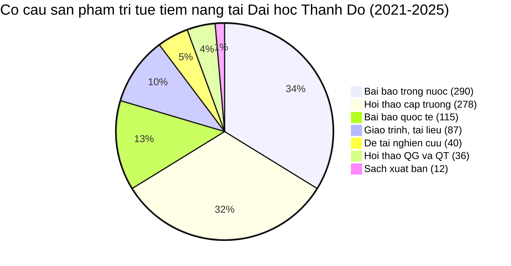
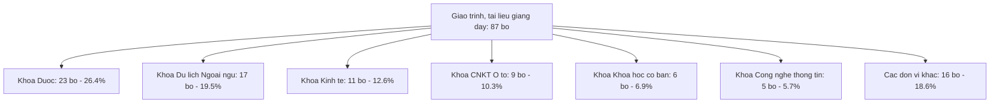
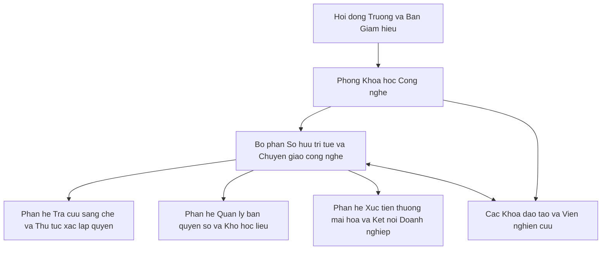

# BÁO CÁO KẾT QUẢ NGHIÊN CỨU TOÀN VĂN: THỰC TRẠNG VÀ HỆ THỐNG GIẢI PHÁP NÂNG CAO HIỆU QUẢ QUẢN LÝ QUYỀN SỞ HỮU TRÍ TUỆ TẠI TRƯỜNG ĐẠI HỌC THÀNH ĐÔ

**Đề tài nghiên cứu khoa học cấp cơ sở năm 2026**  
**Chủ nhiệm đề tài:** Thạc sĩ Nguyễn Thị Tố Uyên  
**Đơn vị:** Viện Quản trị và Công nghệ - Trường Đại học Thành Đô  

---

## LỜI MỞ ĐẦU

Trong nền kinh tế tri thức và cuộc cách mạng công nghiệp lần thứ tư, trường đại học không còn đơn thuần là nơi truyền thụ kiến thức mà đã trở thành trung tâm sáng tạo, sản sinh tri thức mới và chuyển giao công nghệ cho xã hội. Tài sản trí tuệ là nguồn vốn vô hình đặc biệt quan trọng, quyết định năng lực cạnh tranh, uy tín học thuật và khả năng tự chủ bền vững của cơ sở giáo dục đại học.

Báo cáo này được xây dựng trên cơ sở bóc tách, chuẩn hóa và phân tích định lượng toàn bộ kho dữ liệu thực chứng gồm 12 tệp văn bản thể chế và hồ sơ thống kê hoạt động khoa học công nghệ giai đoạn 2021 - 2025 của Trường Đại học Thành Đô. Báo cáo cung cấp căn cứ khoa học và thực tiễn vững chắc cho hai phần cốt lõi của đề tài:
- **Nội dung 2:** Đánh giá toàn diện thực trạng công tác quản lý quyền sở hữu trí tuệ tại Nhà trường.
- **Nội dung 3:** Đề xuất hệ thống giải pháp đồng bộ, khả thi nhằm nâng cao hiệu quả quản lý, bảo hộ và thương mại hóa tài sản trí tuệ tại Trường Đại học Thành Đô giai đoạn 2026 - 2030.

---

# PHẦN 1: THỰC TRẠNG CÔNG TÁC QUẢN LÝ QUYỀN SỞ HỮU TRÍ TUỆ TẠI TRƯỜNG ĐẠI HỌC THÀNH ĐÔ (2021 - 2025)

## 1.1. Khái quát đặc thù phát triển và định hướng khoa học công nghệ của Nhà trường

### 1.1.1. Đặc thù mô hình phát triển và hệ sinh thái giáo dục
Trường Đại học Thành Đô là trường đại học tư thục theo định hướng ứng dụng, kiên định với triết lý giáo dục: Khai sáng Trí tuệ - Rèn luyện Bản lĩnh Năng lực - Tìm kiếm sự Hòa hợp - Hướng tới giá trị Nhân văn cao đẹp. Nhà trường đang vận hành theo mô hình học tập kết hợp trải nghiệm thực tế và hòa hợp với thiên nhiên.

Nhà trường tập trung nguồn lực phát triển 4 trụ cột chuyên môn trọng điểm:
1. **Công nghệ giao thông thông minh:** Trọng tâm là ngành Công nghệ kỹ thuật ô tô, Kỹ thuật điện, điện tử thông minh.
2. **Dịch vụ kỹ thuật số:** Trọng tâm là Kinh tế số, Thương mại điện tử và Logistics thông minh.
3. **Truyền thông và ngôn ngữ quốc tế:** Ngôn ngữ Anh, Ngôn ngữ Trung Quốc và Quản trị du lịch trải nghiệm.
4. **Khoa học sức khỏe và chăm sóc cộng đồng:** Ngành Dược học và chăm sóc sức khỏe.

Mô hình đào tạo ứng dụng với thời lượng thực hành chiếm tỷ trọng lớn tại các doanh nghiệp đối tác tạo ra môi trường rất thuận lợi cho các hoạt động đồng sáng tạo giữa giảng viên, sinh viên và chuyên gia doanh nghiệp.

### 1.1.2. Định hướng chiến lược khoa học công nghệ giai đoạn 2024 - 2028
Theo Kế hoạch hoạt động Khoa học Công nghệ giai đoạn 2024 - 2028, Nhà trường đặt trọng tâm vào việc:
- Gia tăng mạnh mẽ số lượng và chất lượng bài báo công bố quốc tế.
- Tăng cường thu hút các nguồn tài trợ nghiên cứu từ bên ngoài, đặc biệt là các quỹ phát triển khoa học cấp quốc gia.
- Đẩy mạnh hoạt động biên soạn giáo trình, bài giảng số hóa và hoàn thiện cơ sở dữ liệu học liệu phục vụ đào tạo.
- Thúc đẩy gắn kết giữa nghiên cứu khoa học với đổi mới sáng tạo và khởi nghiệp trong toàn thể cán bộ, giảng viên và người học.

---

## 1.2. Thực trạng thể chế, quy chế nội bộ và bộ máy quản lý quyền sở hữu trí tuệ

### 1.2.1. Khung thể chế nội bộ hiện hành
Hệ thống văn bản quản lý khoa học công nghệ của Trường Đại học Thành Đô được điều chỉnh tập trung qua **Quy chế Hoạt động Khoa học Công nghệ** ban hành kèm theo Quyết định số 213/QĐ-ĐHTĐ ngày 28 tháng 12 năm 2021. Trong đó, Chương VI đã xác lập các quy định nền tảng về sở hữu trí tuệ và chuyển giao công nghệ với 3 điều khoản trọng tâm:

1. **Điều 34 (Định nghĩa và phân loại sản phẩm trí tuệ của Trường):** Xác định sản phẩm trí tuệ của Trường là các sản phẩm được hình thành trên cơ sở sử dụng nguồn kinh phí của Trường, hợp tác thông qua Trường hoặc sử dụng cơ sở vật chất của Trường. Danh mục sản phẩm bao gồm: tên trường, biểu trưng nhãn hiệu, bằng độc quyền sáng chế, giải pháp hữu ích, kiểu dáng công nghiệp, bài báo khoa học, đề tài dự án, luận văn, sách, giáo trình, ngân hàng đề thi, phần mềm công nghệ thông tin, mô hình thực hành và quy trình công nghệ mới.
2. **Điều 35 (Quy trình đăng ký quyền sở hữu trí tuệ):** Quy định tác giả nộp đơn đăng ký tại Phòng Khoa học Công nghệ; Phòng có trách nhiệm kiểm tra hình thức trong 25 ngày, yêu cầu sửa đổi bổ sung trong 15 ngày, sau đó trình Hiệu trưởng ký và nộp đơn tại cơ quan nhà nước có thẩm quyền.
3. **Điều 36 (Chuyển giao công nghệ và thương mại hóa kết quả nghiên cứu):**
   - Đối với tài sản trí tuệ thuộc sở hữu của Trường: Tiền thu được sau khi trừ chi phí hợp lệ được phân chia theo tỷ lệ: tác giả hưởng 30%, đơn vị có tác giả hưởng 20%, Quỹ nghiên cứu khoa học của Trường hưởng 50%.
   - Đối với đề tài sử dụng ngân sách nhà nước: 40% nộp ngân sách nhà nước, 30% nộp cho Trường, 30% khen thưởng cho nhóm tác giả nhưng tổng mức thưởng không vượt quá 100 triệu đồng cho một đề tài.

### 1.2.2. Khoảng trống thể chế và bất cập trong tổ chức bộ máy
Qua rà soát chuyên sâu và đối chiếu với Luật Sở hữu trí tuệ hiện hành, công tác thể chế nội bộ bộc lộ các điểm nghẽn lớn:

1. **Bộ máy quản lý kiêm nhiệm, thiếu chuyên môn sâu:** Nhà trường chưa thành lập Bộ phận chuyên trách về sở hữu trí tuệ hoặc Văn phòng chuyển giao công nghệ. Toàn bộ quy trình thủ tục từ tra cứu, thẩm định hình thức đến quản lý theo dõi đơn đăng ký đều dồn lên vai cán bộ Phòng Khoa học Công nghệ. Cán bộ quản lý phải kiêm nhiệm nhiều mảng công việc hành chính đào tạo, chưa được đào tạo bài bản về kỹ năng tra cứu sáng chế chuyên sâu, phân tích tình trạng kỹ thuật, định giá tài sản vô hình và soạn thảo hợp đồng li-xăng.
2. **Tỷ lệ phân chia lợi ích tài chính chưa đủ sức hấp dẫn:** Mức phân chia 30% cho tác giả tại Điều 36 mới chỉ chạm mức sàn tối thiểu của Luật Sở hữu trí tuệ. Kinh nghiệm quốc tế và tại các đại học tự chủ thành công cho thấy để tạo động lực đột phá, tỷ lệ dành cho nhà sáng chế thường dao động từ 50% đến 70%. Bên cạnh đó, việc áp trần thưởng tối đa 100 triệu đồng đối với đề tài sử dụng ngân sách nhà nước vô hình trung làm triệt tiêu động lực theo đuổi các dự án nghiên cứu lớn có giá trị thương mại hóa cao.
3. **Khoảng trống pháp lý trong hoạt động đồng sáng tạo:** Nhà trường đang mở rộng không gian đào tạo tích hợp với doanh nghiệp và hệ sinh thái liên cấp. Tuy nhiên, Quy chế hiện hành hoàn toàn chưa có điều khoản điều chỉnh quyền sở hữu đối với các sản phẩm do sinh viên sáng tạo trong quá trình làm đồ án tốt nghiệp, các sáng kiến đồng sáng tạo giữa giảng viên và đối tác doanh nghiệp, cũng như cơ chế chia sẻ quyền sở hữu khi doanh nghiệp cùng góp vốn và phòng thí nghiệm.
4. **Thiếu vắng quy chế quản trị tài sản trí tuệ số:** Chưa có quy định pháp lý nội bộ về đăng ký bản quyền số cho hệ thống bài giảng điện tử, cơ sở dữ liệu học liệu mở, ngân hàng câu hỏi thi trực tuyến và cơ chế kiểm soát đạo văn tự động.

---

## 1.3. Phân tích thực chứng kết quả hoạt động nghiên cứu và tạo lập tài sản trí tuệ (2021 - 2025)

Dữ liệu bóc tách từ toàn bộ 9 tệp thống kê của Phòng Khoa học Công nghệ phản ánh bức tranh toàn cảnh về hoạt động khoa học công nghệ của Trường Đại học Thành Đô trong 5 năm qua.

### Bảng 1.1: Tổng hợp các sản phẩm khoa học công nghệ và tiềm năng sở hữu trí tuệ (2021 - 2025)

| STT | Phân loại sản phẩm khoa học | 2021 | 2022 | 2023 | 2024 | 2025 | Tổng cộng | Tỷ trọng |
| :---: | :--- | :---: | :---: | :---: | :---: | :---: | :---: | :---: |
| 1 | Bài báo đăng tạp chí khoa học quốc tế | 6 | 13 | 11 | 33 | 52 | **115** | 13,4% |
| 2 | Bài báo đăng tạp chí khoa học trong nước | 54 | 50 | 33 | 44 | 109 | **290** | 33,8% |
| 3 | Sách xuất bản (chuyên khảo, tham khảo) | 0 | 2 | 2 | 2 | 6 | **12** | 1,4% |
| 4 | Giáo trình, tài liệu giảng dạy biên soạn | 26 | 31 | 12 | 7 | 11 | **87** | 10,1% |
| 5 | Báo cáo kỷ yếu Hội thảo quốc tế | 1 | 2 | 3 | 4 | 5 | **15** | 1,7% |
| 6 | Báo cáo kỷ yếu Hội thảo quốc gia | 1 | 3 | 1 | 2 | 14 | **21** | 2,4% |
| 7 | Báo cáo kỷ yếu Hội thảo cấp trường | 49 | 50 | 45 | 60 | 74 | **278** | 32,4% |
| 8 | Đề tài nghiên cứu khoa học cấp cơ sở | 5 | 10 | 7 | 7 | 8 | **37** | 4,3% |
| 9 | Đề tài nghiên cứu khoa học cấp quốc gia | 0 | 0 | 0 | 1 | 2 | **3** | 0,3% |
| **CỘNG** | **Tổng số sản phẩm trí tuệ tiềm năng** | **142** | **161** | **114** | **160** | **281** | **858** | **100%** |

### 1.3.1. Nhóm ấn phẩm học thuật được bảo hộ quyền tác giả (818 ấn phẩm)

1. **Bài báo khoa học quốc tế (115 bài):**
   - Tốc độ tăng trưởng kép hàng năm đạt mức **71,58%/năm**.
   - Quy mô công bố năm 2025 (52 bài) tăng gấp **8,67 lần** so với năm 2021 (6 bài).
   - Chất lượng học thuật khẳng định rõ nét: 19 bài phân hạng chất lượng loại 1; 26 bài phân hạng chất lượng loại 2; 22 bài phân hạng loại 3; 4 bài phân hạng loại 4; 44 bài thuộc hệ thống trích dẫn quốc tế khác. Tổng số bài báo đạt phân hạng uy tín cao loại 1 và loại 2 chiếm **39,13%** tổng công bố quốc tế.
2. **Bài báo tạp chí trong nước (290 bài):**
   - Duy trì số lượng ổn định từ 33 đến 54 bài/năm trong giai đoạn 2021 - 2024 và bùng nổ mạnh mẽ vào năm 2025 với 109 bài (tăng trưởng **147,73%** so với năm 2024). Các bài viết đăng tải chủ yếu trên Tạp chí Nghiên cứu khoa học và Phát triển của Trường Đại học Thành Đô và các tạp chí chuyên ngành có chỉ số ISSN được Hội đồng Giáo sư Nhà nước tính điểm.
3. **Sách xuất bản (12 cuốn):**
   - Bao gồm các sách chuyên khảo và tham khảo chuyên sâu về kinh tế, lịch sử, kỹ thuật và quản trị, xuất bản tại các nhà xuất bản uy tín cấp quốc gia (Nhà xuất bản Chính trị Quốc gia Sự thật, Nhà xuất bản Đại học Quốc gia Hà Nội).
4. **Giáo trình và tài liệu giảng dạy biên soạn (87 bộ):**
   - Gồm 39 bộ tài liệu tham khảo, 27 bộ giáo trình thực hành, 17 bộ tài liệu giảng dạy và 14 bộ giáo trình lý thuyết.
   - Cơ cấu đơn vị chủ trì: Khoa Dược chiếm tỷ trọng cao nhất với 23 bộ (26,4%), tiếp theo là Khoa Du lịch - Ngoại ngữ với 17 bộ (19,5%), Khoa Kinh tế với 11 bộ (12,6%), Khoa Công nghệ kỹ thuật Ô tô với 9 bộ (10,3%), Khoa Khoa học cơ bản với 6 bộ, Khoa Công nghệ thông tin với 5 bộ.
   - **Vấn đề sở hữu trí tuệ:** Toàn bộ 87 bộ giáo trình đều đã được nghiệm thu và ban hành theo Quyết định của Hiệu trưởng để lưu hành nội bộ, thuộc quyền tài sản của Nhà trường. Tuy nhiên, *chưa có bất kỳ giáo trình nào được đăng ký xác lập quyền tác giả tại Cục Bản quyền tác giả*. Việc lưu hành nội bộ dưới dạng tệp điện tử hoặc bản in tiềm ẩn rủi ro rất cao về sao chép lậu và xâm phạm quyền tác giả trên không gian số.

### 1.3.2. Nhóm đề tài nghiên cứu khoa học và tiềm năng bảo hộ sở hữu công nghiệp (40 đề tài)

1. **Đề tài cấp cơ sở (37 đề tài):**
   - Cơ cấu lĩnh vực: Khoa học xã hội, nhân văn và ngôn ngữ có 17 đề tài; khối Y Dược và Khoa học sức khỏe có 9 đề tài; khối Kinh tế, Quản trị và Luật có 6 đề tài; khối Kỹ thuật, Công nghệ ô tô và Công nghệ thông tin có 5 đề tài.
   - Sản phẩm nghiệm thu: 100% đề tài đều có báo cáo tổng kết và bài báo khoa học. Đáng chú ý, có nhiều sản phẩm mang tính kỹ thuật ứng dụng cao:
     * *Khối Kỹ thuật ô tô:* Mô hình kiểm tra và sửa chữa hệ thống khởi động điện trên ô tô.
     * *Khối Y Dược:* Sản phẩm màng cầm máu y sinh ứng dụng lâm sàng; Bộ mẫu chuẩn dược liệu cây thuốc.
   - **Thực trạng bảo hộ:** Toàn bộ các sản phẩm kỹ thuật, quy trình bào chế và mô hình thiết bị nêu trên đều *chưa từng được tra cứu khả năng bảo hộ và chưa nộp đơn đăng ký Bằng độc quyền sáng chế hay Giải pháp hữu ích*.
2. **Đề tài cấp quốc gia do Quỹ Phát triển khoa học và công nghệ Quốc gia tài trợ (3 đề tài):**
   - Đề tài về phương pháp học tập vi mô trong giáo dục đại học do Tiến sĩ Phạm Hùng Hiệp làm chủ nhiệm (Kinh phí: 870 triệu đồng, thời gian 2024 - 2026).
   - Đề tài về vật liệu polyelectrolyte và hạt nano vô cơ lớp phủ bề mặt do Tiến sĩ Nguyễn Ngọc Linh làm chủ nhiệm (Kinh phí: 1,9 tỷ đồng, phê duyệt năm 2025).
   - Đề tài về mô hình học tập tự điều chỉnh tích hợp trí tuệ nhân tạo tạo sinh do Phó Giáo sư, Tiến sĩ Phan Thị Thanh Thảo làm chủ nhiệm (Kinh phí: 1,9 tỷ đồng, phê duyệt năm 2025).
   - **Tổng kinh phí ngân sách nhà nước tài trợ đạt 4,67 tỷ đồng.** Đây là bước nhảy vọt về năng lực nghiên cứu đỉnh cao của Nhà trường, chứa đựng tiềm năng rất lớn để tạo ra các thuật toán phần mềm mới, vật liệu mới và quy trình công nghệ cao.

### 1.3.3. Thực trạng hoạt động thương mại hóa và nhận thức sở hữu trí tuệ
- **Thương mại hóa và chuyển giao công nghệ:** Trong giai đoạn 2021 - 2025, Nhà trường chưa ký kết được hợp đồng chuyển giao công nghệ có thu phí với doanh nghiệp bên ngoài; chưa có doanh nghiệp khởi nguồn công nghệ nào được thành lập từ các sáng chế hay kết quả nghiên cứu của trường.
- **Nhận thức của cán bộ, giảng viên và sinh viên:**
  * Giảng viên cơ bản nhận thức được việc tránh sao chép bài báo khoa học nhưng chưa có ý thức chủ động bảo vệ quyền sở hữu công nghiệp đối với các giải pháp kỹ thuật trước khi xuất bản.
  * Tình trạng công bố bài báo hoặc báo cáo hội thảo trước khi nộp đơn đăng ký sáng chế/giải pháp hữu ích làm mất đi tính mới tuyệt đối của sáng kiến theo luật định.
  * Sinh viên chưa được trang bị đầy đủ kiến thức về quyền tác giả đối với tài nguyên số, dẫn đến hiện tượng tải và chia sẻ tài liệu học tập chưa có bản quyền.

---

## 1.4. Đánh giá tổng hợp ma trận điểm mạnh, điểm yếu, cơ hội và thách thức

### Bảng 1.2: Ma trận phân tích điểm mạnh, điểm yếu, cơ hội và thách thức

| Yếu tố | Nội dung phân tích cụ thể |
| :--- | :--- |
| **Điểm mạnh** | - Đã có Quy chế hoạt động khoa học công nghệ (Quyết định số 213/QĐ-ĐHTĐ) dành riêng Chương VI quy định về sở hữu trí tuệ. - Năng lực công bố học thuật tăng trưởng bùng nổ (bài báo quốc tế tăng gần 9 lần sau 5 năm; bài báo trong nước tăng 147% năm 2025). - Có nguồn tài trợ nghiên cứu cấp quốc gia uy tín từ Quỹ Phát triển khoa học và công nghệ Quốc gia với tổng kinh phí 4,67 tỷ đồng. - Khối ngành Y Dược và Công nghệ kỹ thuật Ô tô sở hữu hệ thống phòng thí nghiệm và xưởng thực hành hiện đại, có khả năng tạo ra sản phẩm kỹ thuật thực chứng. |
| **Điểm yếu** | - Số lượng đăng ký xác lập quyền sở hữu công nghiệp (sáng chế, giải pháp hữu ích) bằng 0. - 87 bộ giáo trình lưu hành nội bộ chưa đăng ký bản quyền tác giả chính thức. - Chưa có bộ phận chuyên trách về sở hữu trí tuệ và chuyển giao công nghệ; cán bộ quản lý làm việc kiêm nhiệm. - Tỷ lệ phân chia lợi ích 30% cho tác giả còn thấp; mức trần thưởng 100 triệu đồng chưa tạo động lực lớn. - Thiếu vắng hạ tầng phần mềm quản trị chu trình sống của tài sản trí tuệ số. |
| **Cơ hội** | - Luật Sở hữu trí tuệ sửa đổi và Luật Khoa học, công nghệ và đổi mới sáng tạo mở ra cơ chế tự chủ rất lớn cho trường đại học trong việc tự quyết định định giá và thương mại hóa tài sản trí tuệ. - Khung chiến lược Edupark tạo không gian hợp tác đồng sáng tạo thực nghiệm rất rộng mở với mạng lưới doanh nghiệp đối tác. - Nhu cầu thị trường đối với các giải pháp giao thông thông minh, chăm sóc sức khỏe và dược liệu thiên nhiên đang gia tăng mạnh mẽ. |
| **Thách thức** | - Rủi ro xâm phạm quyền tác giả và phát tán tài liệu học tập trái phép trên không gian mạng ngày càng tinh vi. - Thủ tục và thời gian thẩm định đơn sáng chế tại cơ quan quản lý nhà nước kéo dài từ 24 đến 36 tháng. - Cạnh tranh gay gắt từ các trường đại học lớn đã có văn phòng chuyển giao công nghệ chuyên nghiệp và quỹ tài trợ mạo hiểm dồi dào. |

---

# PHẦN 2: HỆ THỐNG GIẢI PHÁP NÂNG CAO HIỆU QUẢ QUẢN LÝ QUYỀN SỞ HỮU TRÍ TUỆ TẠI TRƯỜNG ĐẠI HỌC THÀNH ĐÔ (2026 - 2030)

## 2.1. Quan điểm và mục tiêu phát triển

### 2.1.1. Quan điểm phát triển
1. **Tài sản trí tuệ là tài sản chiến lược:** Đặt tài sản trí tuệ làm đòn bẩy trung tâm để nâng cao chất lượng đào tạo, khẳng định thương hiệu học thuật và gia tăng nguồn thu bền vững cho Nhà trường.
2. **Cân bằng và hài hòa lợi ích:** Hoàn thiện cơ chế đãi ngộ vượt trội cho người trực tiếp sáng tạo, bảo đảm sự hài hòa quyền lợi giữa Nhà trường, tập thể tác giả và các doanh nghiệp đồng hành.
3. **Chuyển dịch từ hành chính sang quản trị kiến tạo:** Thay đổi căn bản phương thức quản lý sở hữu trí tuệ từ việc xét duyệt hồ sơ hành chính thụ động sang việc chủ động ươm tạo, đồng hành pháp lý và thúc đẩy thương mại hóa tài sản vô hình.

### 2.1.2. Mục tiêu chiến lược đến năm 2030
- **Giai đoạn 2026 - 2027:**
  * Ban hành Quy chế quản trị tài sản trí tuệ mới của Trường Đại học Thành Đô.
  * Thành lập Bộ phận chuyên trách Sở hữu trí tuệ và Chuyển giao công nghệ trực thuộc Phòng Khoa học Công nghệ.
  * Hoàn thành việc đăng ký quyền tác giả chính thức cho tối thiểu 30 bộ giáo trình, tài liệu giảng dạy trọng điểm.
  * Nộp đơn đăng ký bảo hộ từ 1 đến 2 giải pháp hữu ích từ các đề tài nghiên cứu khối ngành Y Dược và Kỹ thuật ô tô.
- **Giai đoạn 2028 - 2030:**
  * Đạt tối thiểu từ 3 đến 5 văn bằng bảo hộ độc quyền (Bằng độc quyền giải pháp hữu ích hoặc Bằng độc quyền sáng chế).
  * Vận hành hệ thống phần mềm trực tuyến quản trị vòng đời tài sản trí tuệ tích hợp kiểm soát liêm chính học thuật.
  * Ký kết từ 2 đến 3 hợp đồng chuyển giao công nghệ hoặc cấp phép khai thác thương mại với doanh nghiệp.

---

## 2.2. Nhóm giải pháp 1: Hoàn thiện thể chế nội bộ và cơ chế phân chia lợi ích tài chính

### 2.2.1. Ban hành Quy chế quản trị tài sản trí tuệ độc lập
Nhà trường cần tách nội dung Chương VI của Quyết định số 213/QĐ-ĐHTĐ thành một văn bản quy phạm nội bộ độc lập mang tên: **"Quy chế Quản trị tài sản trí tuệ và Chuyển giao công nghệ Trường Đại học Thành Đô"**. Quy chế mới cần tập trung sửa đổi các điểm cốt lõi:

1. **Điều chỉnh đột phá cơ chế phân chia lợi ích tài chính (Sửa đổi Điều 36):**
   - Đối với tài sản trí tuệ do Trường sở hữu được thương mại hóa thành công: Nâng tỷ lệ phân chia cho tác giả trực tiếp lên mức **50% - 60%** doanh thu ròng sau thuế; trích **20%** cho Khoa/Viện nơi tác giả công tác để khuyến khích đơn vị hỗ trợ nghiên cứu; trích **20% - 30%** nộp vào Quỹ Phát triển khoa học công nghệ của Trường để tái đầu tư.
   - Bỏ trần khống chế mức thưởng 100 triệu đồng đối với các nhiệm vụ sử dụng ngân sách nhà nước, áp dụng tỷ lệ chia thưởng linh hoạt theo doanh thu thực tế được pháp luật cho phép.
2. **Quy định về quy trình thẩm định tính mới trước khi công bố khoa học:**
   - Ban hành quy định bắt buộc: Trước khi giảng viên nộp bài báo khoa học công bố ra công chúng hoặc nộp báo cáo tổng kết đề tài có chứa giải pháp kỹ thuật, quy trình công nghệ mới, phải gửi bản tóm tắt ý tưởng kỹ thuật đến Bộ phận chuyên trách sở hữu trí tuệ để tra cứu tình trạng kỹ thuật. Nếu giải pháp có khả năng đăng ký sáng chế/giải pháp hữu ích, Nhà trường sẽ ưu tiên nộp đơn đăng ký sở hữu công nghiệp trước để giữ ngày ưu tiên, sau đó tác giả mới được xuất bản bài báo.

### 2.2.2. Quy định cơ chế xác lập quyền đối với hoạt động đồng sáng tạo
- **Đối với sinh viên:** Các đồ án tốt nghiệp, công trình nghiên cứu của sinh viên do sinh viên tự đầu tư thời gian và ý tưởng sẽ thuộc quyền tác giả và quyền sở hữu của sinh viên. Nếu Nhà trường có tài trợ kinh phí hoặc cung cấp nguyên vật liệu đặc thù của phòng thí nghiệm, Nhà trường và sinh viên sẽ ký thỏa thuận đồng sở hữu quyền tài sản theo tỷ lệ vốn góp.
- **Đối với đối tác doanh nghiệp:** Quy định mẫu hợp đồng liên kết nghiên cứu trong hệ sinh thái Edupark, trong đó xác định rõ: doanh nghiệp bỏ vốn sẽ được quyền ưu tiên nhận chuyển giao độc quyền hoặc không độc quyền trong một thời hạn nhất định; Nhà trường giữ quyền sử dụng phi thương mại để phục vụ giảng dạy và đào tạo.

---

## 2.3. Nhóm giải pháp 2: Kiện toàn tổ chức bộ máy và phát triển nhân lực chuyên trách

### 2.3.1. Thành lập Bộ phận Sở hữu trí tuệ và Chuyển giao công nghệ
- Cơ cấu tổ chức: Trực thuộc Phòng Khoa học Công nghệ, phối hợp chặt chẽ với Trung tâm Khởi nghiệp và Đổi mới sáng tạo của Trường.
- Nhân lực: Bố trí tối thiểu từ 2 đến 3 cán bộ chuyên trách có trình độ từ thạc sĩ trở lên thuộc hai khối chuyên môn: (1) Chuyên viên pháp lý sở hữu trí tuệ (phụ trách thủ tục, đơn từ, bản quyền tác giả); (2) Chuyên viên kỹ thuật và thương mại hóa (phụ trách tra cứu sáng chế, kết nối doanh nghiệp, xúc tiến thương mại).

### 2.3.2. Nâng cao năng lực chuyên môn cho đội ngũ quản lý và giảng viên
- Cử cán bộ phụ trách tham gia các chương trình đào tạo chuyên sâu về đại diện sở hữu công nghiệp và thẩm định đơn do Cục Sở hữu trí tuệ tổ chức.
- Mời các luật sư chuyên về sở hữu trí tuệ và chuyên gia chuyển giao công nghệ tổ chức các khóa tập huấn ngắn hạn cho trưởng các bộ môn, các nhà khoa học chủ chốt về: kỹ thuật viết bản mô tả sáng chế, phạm vi bảo hộ yêu cầu, chiến lược định giá tài sản trí tuệ và xử lý tranh chấp bản quyền.

---

## 2.4. Nhóm giải pháp 3: Số hóa công tác quản trị và bảo hộ tài sản trí tuệ số

### 2.4.1. Xây dựng phần mềm Quản trị vòng đời tài sản trí tuệ
Nhà trường cần triển khai hệ thống phần mềm quản lý trực tuyến tích hợp với cổng thông tin nội bộ của Trường, bao gồm các chức năng cốt lõi:
1. **Sổ tay ý tưởng sáng tạo điện tử:** Cho phép giảng viên, sinh viên đăng ký ý tưởng nghiên cứu ngay từ giai đoạn ban đầu để ghi nhận mốc thời gian hình thành ý tưởng.
2. **Cơ sở dữ liệu quản lý ấn phẩm và tài sản trí tuệ:** Lưu trữ toàn bộ 87 bộ giáo trình, 12 cuốn sách, 405 bài báo khoa học và 40 đề tài dưới dạng siêu dữ liệu có khả năng tra cứu nhanh theo tác giả, khoa, năm và tình trạng pháp lý.
3. **Theo dõi tiến độ hồ sơ đăng ký:** Tự động cập nhật tiến trình thẩm định hình thức, công bố đơn và thẩm định nội dung của các đơn đăng ký sở hữu trí tuệ gửi tới cơ quan quản lý nhà nước.

### 2.4.2. Bảo hộ bản quyền và kiểm soát liêm chính học thuật đối với tài nguyên số
- **Gắn mã định danh số và đăng ký bản quyền tác giả:** Lập kế hoạch đăng ký tập trung tại Cục Bản quyền tác giả cho 87 bộ giáo trình và tài liệu giảng dạy đã được nghiệm thu; mã hóa bảo vệ tệp điện tử bằng chứng thư số trước khi tải lên hệ thống học tập trực tuyến.
- **Tích hợp phần mềm chống sao chép tự động:** Bắt buộc 100% khóa luận tốt nghiệp, luận văn thạc sĩ và báo cáo đề tài nghiên cứu phải trải qua bước kiểm tra trùng lặp trên phần mềm kiểm tra liêm chính học thuật (mức độ trùng lặp không vượt quá 20%) trước khi thành lập hội đồng đánh giá nghiệm thu.

---

## 2.5. Nhóm giải pháp 4: Thúc đẩy thương mại hóa, ươm tạo công nghệ và nâng cao nhận thức

### 2.5.1. Thành lập Quỹ hỗ trợ xác lập quyền sở hữu trí tuệ
- Nhà trường cần trích tối thiểu từ **10% đến 15%** kinh phí từ Quỹ Phát triển khoa học và công nghệ hàng năm để hình thành "Quỹ hỗ trợ xác lập quyền sở hữu trí tuệ".
- Nguồn quỹ này dùng để:
  * Chi trả toàn bộ kinh phí tra cứu thông tin sáng chế tại cơ sở dữ liệu quốc tế.
  * Chi phí thuê chuyên gia soạn thảo bản mô tả sáng chế và các khoản lệ phí nộp đơn tại cơ quan nhà nước.
  * Khen thưởng đột xuất: Thưởng trực tiếp bằng tiền mặt (từ 20 đến 50 triệu đồng) cho nhóm tác giả có giải pháp được cấp Bằng độc quyền sáng chế hoặc Giải pháp hữu ích.

### 2.5.2. Lựa chọn các kết quả nghiên cứu trọng điểm để ươm tạo bảo hộ
Dựa trên kết quả bóc tách 37 đề tài cấp cơ sở và 3 đề tài cấp quốc gia, Nhà trường cần ưu tiên hỗ trợ các nhóm nghiên cứu sau hoàn thiện hồ sơ đăng ký độc quyền:
1. **Nhóm ngành Công nghệ kỹ thuật Ô tô:** Hỗ trợ hoàn thiện bản vẽ thiết kế và bản mô tả kỹ thuật cho "Mô hình kiểm tra và sửa chữa hệ thống khởi động điện trên ô tô" để đăng ký Giải pháp hữu ích.
2. **Nhóm ngành Dược học:** Hỗ trợ bảo hộ quy trình bào chế và chế phẩm đối với "Sản phẩm màng cầm máu y sinh ứng dụng dược liệu" để đăng ký Bằng độc quyền sáng chế.
3. **Nhóm đề tài cấp quốc gia:** Đồng hành cùng nhóm nghiên cứu của Tiến sĩ Nguyễn Ngọc Linh (vật liệu nano phủ bề mặt) và nhóm nghiên cứu của Phó Giáo sư, Tiến sĩ Phan Thị Thanh Thảo (mô hình học tập tự điều chỉnh tích hợp trí tuệ nhân tạo) để đăng ký bản quyền phần mềm và sáng chế quy trình ngay khi có kết quả nghiệm thu từng phần.

### 2.5.3. Nâng cao văn hóa tôn trọng tài sản trí tuệ trong toàn trường
- Đưa chuyên đề "Sở hữu trí tuệ và Đạo đức nghiên cứu khoa học" vào chương trình tuần sinh hoạt công dân đầu khóa cho 100% tân sinh viên.
- Tổ chức thường niên cuộc thi "Sáng tạo và Khởi nghiệp dựa trên tài sản trí tuệ Thành Đô", khuyến khích sinh viên các khoa liên kết thành các nhóm đa ngành để giải quyết các bài toán kỹ thuật từ doanh nghiệp đối tác.

---

## 2.6. Lộ trình thực hiện và điều kiện bảo đảm nguồn lực

### Bảng 2.1: Lộ trình triển khai hệ thống giải pháp (2026 - 2030)

| Năm thực hiện | Các nhiệm vụ trọng tâm | Sản phẩm đầu ra cụ thể | Đơn vị chủ trì |
| :---: | :--- | :--- | :--- |
| **2026** | - Rà soát và sửa đổi Quyết định số 213/QĐ-ĐHTĐ. - Thành lập Bộ phận chuyên trách Sở hữu trí tuệ. - Đăng ký quyền tác giả cho giáo trình trọng điểm. | - Ban hành Quy chế quản trị tài sản trí tuệ mới. - Quyết định thành lập Bộ phận chuyên trách. - 20 - 30 Giấy chứng nhận quyền tác giả. | Phòng Khoa học Công nghệ, Viện Quản trị và Công nghệ |
| **2027** | - Triển khai phần mềm Quản trị tài sản trí tuệ trực tuyến. - Hỗ trợ nộp đơn đăng ký Giải pháp hữu ích ngành Ô tô và Dược. - Ban hành quy định liêm chính học thuật số. | - Phần mềm vận hành chính thức. - Nộp từ 1 đến 2 đơn đăng ký Giải pháp hữu ích. - 100% khóa luận được kiểm tra trùng lặp. | Phòng KHCN, Trung tâm CNTT, Khoa Dược, Khoa CNKT Ô tô |
| **2028** | - Thí điểm ký kết hợp đồng chuyển giao công nghệ đầu tiên. - Hỗ trợ nộp đơn sáng chế từ đề tài Quỹ NAFOSTED. - Đánh giá sơ kết 3 năm thực hiện quy chế mới. | - 01 Hợp đồng chuyển giao công nghệ. - 01 Đơn đăng ký sáng chế cấp quốc gia. - Báo cáo sơ kết thực thi thể chế. | Phòng KHCN, Ban Giám hiệu, Các nhóm nghiên cứu |
| **2029 - 2030** | - Hoàn thiện mô hình đại học khởi nguồn công nghệ. - Mở rộng mạng lưới thương mại hóa tài sản trí tuệ trong khối ASEAN. | - Đạt từ 3 đến 5 văn bằng bảo hộ độc quyền. - Tối thiểu 2 doanh nghiệp khởi nguồn công nghệ. | Ban Giám hiệu, Phòng KHCN, Doanh nghiệp đối tác |

---

# PHẦN 3: KẾT LUẬN VÀ KIẾN NGHỊ

### 3.1. Kết luận
Dữ liệu thực chứng 5 năm (2021 - 2025) tại Trường Đại học Thành Đô cho thấy sự phát triển bứt phá về năng lực công bố khoa học (818 ấn phẩm) và tiềm năng nghiên cứu đỉnh cao (40 đề tài, trong đó có 3 đề tài quốc gia quy mô lớn). Tuy nhiên, công tác quản lý quyền sở hữu trí tuệ đang đứng trước những thách thức mang tính bước ngoặt: sự thiếu vắng hoàn toàn các bằng độc quyền sở hữu công nghiệp, nguy cơ xâm phạm bản quyền đối với 87 bộ giáo trình nội bộ và cơ chế quản lý kiêm nhiệm, chậm chuyển đổi số.

Hệ thống 4 nhóm giải pháp đồng bộ được đề xuất trong báo cáo này gồm: (1) Hoàn thiện thể chế và nâng tỷ lệ đãi ngộ tác giả lên mức cạnh tranh; (2) Kiện toàn bộ máy chuyên trách; (3) Số hóa quy trình quản trị vòng đời tài sản trí tuệ; (4) Xúc tiến thương mại hóa và ưu tiên bảo hộ sản phẩm kỹ thuật trọng điểm — là lời giải toàn diện, mang tính đột phá và hoàn toàn khả thi, giúp Trường Đại học Thành Đô chuyển hóa tiềm năng học thuật to lớn thành giá trị kinh tế và vị thế thương hiệu vững chắc.

### 3.2. Kiến nghị
1. **Kiến nghị với Hội đồng trường và Ban Giám hiệu:**
   - Sớm phê duyệt chủ trương ban hành Quy chế quản trị tài sản trí tuệ độc lập của Trường trong năm 2026.
   - Ưu tiên phân bổ nguồn kinh phí thỏa đáng (tối thiểu 10% Quỹ khoa học công nghệ) để lập Quỹ hỗ trợ bảo hộ sở hữu trí tuệ cấp trường.
2. **Kiến nghị với Phòng Khoa học Công nghệ:**
   - Khẩn trương tham mưu phương án thành lập Bộ phận chuyên trách về sở hữu trí tuệ và chuyển giao công nghệ.
   - Chủ trì phối hợp với các Khoa rà soát, lựa chọn ngay các giáo trình và mô hình kỹ thuật tiềm năng để triển khai thủ tục đăng ký trong quý IV năm 2026.
3. **Kiến nghị với các Khoa đào tạo và Viện nghiên cứu:**
   - Quán triệt tinh thần bảo vệ quyền sở hữu trí tuệ trước khi công bố học thuật đến từng giảng viên và nhà nghiên cứu.
   - Tích cực kết nối với các doanh nghiệp trong hệ sinh thái Edupark để xác định các bài toán thực tiễn đặt hàng cho nghiên cứu ứng dụng.
