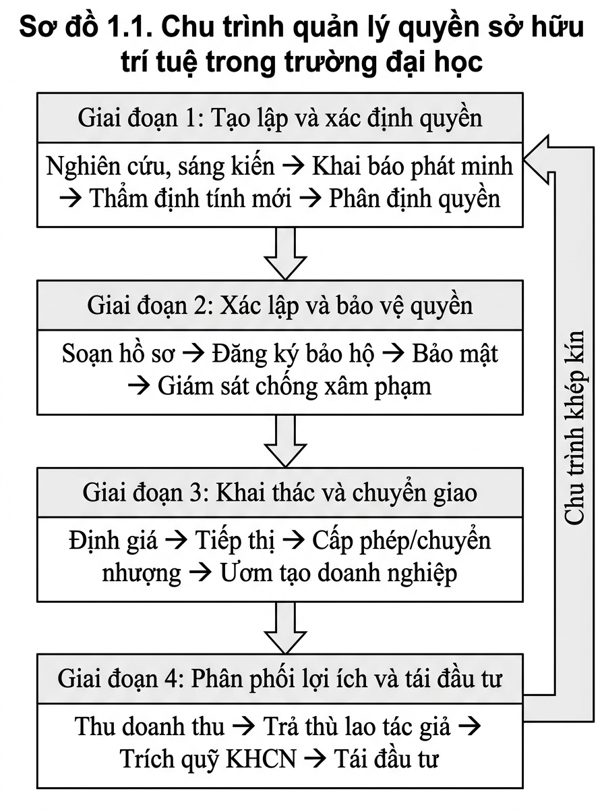
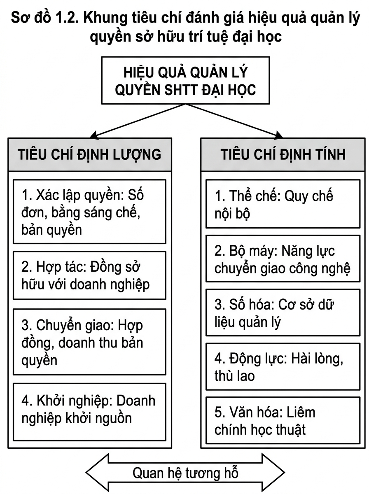

# CHƯƠNG 1. CƠ SỞ LÝ LUẬN VÀ PHÁP LÝ VỀ QUẢN LÝ QUYỀN SỞ HỮU TRÍ TUỆ TRONG CƠ SỞ GIÁO DỤC ĐẠI HỌC

Công tác quản lý quyền sở hữu trí tuệ trong các cơ sở giáo dục đại học là một lĩnh vực quản trị mang tính đặc thù cao, nằm ở giao thoa giữa pháp luật sở hữu trí tuệ, pháp luật giáo dục đại học và cơ chế tự chủ tài chính. Để xây dựng cơ sở khoa học vững chắc cho việc khảo sát, đánh giá thực trạng và đề xuất hệ thống giải pháp nâng cao hiệu quả quản lý quyền sở hữu trí tuệ tại Trường Đại học Thành Đô, Chương 1 tập trung hệ thống hóa những vấn đề lý luận cốt lõi, phân tích khung khổ pháp lý hiện hành, đúc rút bài học kinh nghiệm thực tiễn và thiết lập khung phân tích toàn diện cho toàn bộ công trình nghiên cứu.

## 1.1. Một số vấn đề lý luận về quyền sở hữu trí tuệ và quản lý quyền sở hữu trí tuệ trong cơ sở giáo dục đại học

### 1.1.1. Khái niệm tài sản trí tuệ, quyền sở hữu trí tuệ và quản lý quyền sở hữu trí tuệ

*Thứ nhất, về khái niệm tài sản trí tuệ trong môi trường học thuật:*

Trong nền kinh tế tri thức và cuộc cách mạng công nghiệp lần thứ tư, tài sản trí tuệ được xác định là nguồn vốn vô hình chiến lược cốt lõi, quyết định trực tiếp năng lực sáng tạo, uy tín khoa học và sức cạnh tranh của mỗi cơ sở giáo dục đại học. Dưới góc độ chuẩn mực quốc tế, Tổ chức Sở hữu trí tuệ thế giới (năm 2020) định nghĩa tài sản trí tuệ bao gồm mọi kết quả sáng tạo của tư duy con người, từ các tác phẩm văn học nghệ thuật, bài giảng, giáo trình cho đến các sáng chế công nghệ, giải pháp kỹ thuật, kiểu dáng công nghiệp, nhãn hiệu và chương trình máy tính. Bổ sung cho góc nhìn này, Milliken và Allen (năm 2013) nhấn mạnh đây là các sản phẩm độc đáo sở hữu giá trị kinh tế tiềm năng và mang lại lợi thế cạnh tranh rõ nét cho chủ thể sở hữu.

Từ lăng kính lý luận học thuật, Fisher (năm 2001) và Guan (năm 2014) chỉ ra rằng tài sản trí tuệ là sự kết hợp hữu cơ giữa tính trí tuệ (sản phẩm kết tinh từ sự đầu tư lao động tư duy nghiêm túc) và tính tài sản (khả năng sinh lời kinh tế hoặc mang lại lợi ích pháp lý), được điều chỉnh và điều tiết bởi hệ thống các định chế pháp luật chuyên biệt. Để luận giải căn nguyên và bản chất pháp lý của việc bảo hộ tài sản trí tuệ, lý luận quốc tế xác lập bốn trường phái lý thuyết nền tảng:
- Lý thuyết công cụ và phúc lợi xã hội: Xác định quyền độc quyền có thời hạn là đòn bẩy kinh tế thiết yếu nhằm kích thích cơ sở đào tạo và nhà khoa học đầu tư thời gian, chi phí nghiên cứu tạo ra tri thức mới phục vụ xã hội.
- Lý thuyết lao động: Khẳng định nhà khoa học có quyền tự nhiên đối với các thành quả sáng tạo do chính sức lao động trí óc của mình kết tinh tạo thành.
- Lý thuyết tính cách: Coi sản phẩm sáng tạo học thuật là sự mở rộng tư duy và nhân cách của tác giả, đòi hỏi pháp luật phải bảo hộ tuyệt đối các quyền nhân thân không thể chuyển giao.
- Lý thuyết hoạch định xã hội: Vận dụng quyền sở hữu trí tuệ như một công cụ thể chế nhằm thúc đẩy một xã hội dân chủ, đa dạng văn hóa và nuôi dưỡng môi trường đổi mới sáng tạo bền vững (Fisher, năm 2001).

Đáng chú ý, Cục Sở hữu trí tuệ (năm 2020) đã phân nhánh rõ rệt khái niệm này: nếu đối với cơ quan quản lý và doanh nghiệp, tài sản trí tuệ gắn liền với đầu tư và thương mại, thì đối với các trường đại học và viện nghiên cứu, tài sản trí tuệ được khu biệt thành các kết quả học thuật cốt lõi như ý tưởng khoa học, công trình nghiên cứu, bài báo chuyên ngành, giáo trình, sáng chế công nghệ và phần mềm ứng dụng.

*Thứ hai, về quyền sở hữu trí tuệ trong trường đại học:*

Để xác lập cơ chế bảo hộ cho các khối tài sản vô hình đó, quyền sở hữu trí tuệ được thiết lập như một khung pháp lý chuyên biệt. Các điều ước quốc tế như Công ước Stockholm năm 1967 về thành lập Tổ chức Sở hữu trí tuệ thế giới hay Hiệp định về các khía cạnh liên quan tới thương mại của quyền sở hữu trí tuệ đều xác định quyền sở hữu trí tuệ là quyền độc quyền có thời hạn trao cho chủ thể sáng tạo nhằm khai thác, sử dụng, định đoạt và ngăn chặn hành vi sao chép trái phép. Tại Việt Nam, Điều 4 Luật Sở hữu trí tuệ quy định quyền sở hữu trí tuệ là quyền của tổ chức, cá nhân đối với tài sản trí tuệ, bao gồm quyền tác giả và quyền liên quan, quyền sở hữu công nghiệp và quyền đối với giống cây trồng (Văn phòng Quốc hội, năm 2026).

Trong cơ sở giáo dục đại học, quyền sở hữu trí tuệ được phân thành ba nhóm cấu thành chủ yếu:
- Nhóm quyền tác giả và quyền liên quan: Gắn với giáo trình, bài giảng, tài liệu học tập, bài báo khoa học, báo cáo nghiên cứu, luận văn, luận án, phần mềm máy tính và hệ thống cơ sở dữ liệu học liệu số.
- Nhóm quyền sở hữu công nghiệp: Gắn với sáng chế, giải pháp hữu ích, kiểu dáng công nghiệp, thiết kế bố trí và bí mật kinh doanh phát sinh từ các đề tài nghiên cứu khoa học và dự án phát triển công nghệ.
- Nhóm nhãn hiệu và chỉ dẫn thương mại: Gắn với tên trường, biểu trưng, khẩu hiệu và các dấu hiệu nhận diện thương hiệu gắn liền với uy tín đào tạo và nghiên cứu của nhà trường.

*Thứ ba, về quản lý quyền sở hữu trí tuệ trong cơ sở giáo dục đại học:*

Quản lý quyền sở hữu trí tuệ trong cơ sở giáo dục đại học là hệ thống các hoạt động có chủ đích nhằm hoạch định chính sách thể chế, ban hành quy chế nội bộ, thiết lập bộ máy chuyên trách và vận hành các quy trình nghiệp vụ để điều tiết toàn bộ chu trình sống của tài sản trí tuệ, bao gồm toàn bộ tiến trình từ khâu hình thành ý tưởng nghiên cứu, thẩm định tính mới, bảo mật thông tin, đăng ký xác lập quyền bảo hộ, cho đến khai thác thương mại hóa, chuyển giao công nghệ và bảo vệ quyền sở hữu trí tuệ trước các hành vi xâm phạm (Bradley và cộng sự, năm 2013; Goldfarb và Henrekson, năm 2003).

Khác biệt căn bản với khu vực doanh nghiệp thương mại vốn ưu tiên mục tiêu duy nhất là tối đa hóa lợi nhuận tài chính và bảo vệ thị phần độc quyền (Teece, năm 2018), quản lý sở hữu trí tuệ trong trường đại học mang bản chất lưỡng dụng và đa mục tiêu phức tạp (Nguyễn Minh Huyền Trang, năm 2025). Một mặt, nhà trường phải kiên định sứ mệnh học thuật cốt lõi là lưu giữ, sáng tạo và lan tỏa tự do tri thức khoa học phụng sự cộng đồng; mặt khác, nhà trường phải thiết lập cơ chế bảo hộ độc quyền để thu hồi chi phí nghiên cứu, tái đầu tư cơ sở vật chất và tạo nguồn thu hợp pháp cho nhà khoa học (Etzkowitz, năm 2003; Shane, năm 2004; Perkmann và cộng sự, năm 2013). Do đó, quản lý sở hữu trí tuệ đại học không thể áp dụng máy móc mô hình doanh nghiệp, mà đòi hỏi một khung quản trị cân bằng giữa sứ mệnh công ích học thuật và hiệu quả kinh tế.

---

### 1.1.2. Đặc điểm của tài sản trí tuệ trong môi trường đại học

*Thứ nhất, năm đặc điểm bản chất của tài sản trí tuệ đại học:*

1. **Tính vô hình và tri thức ẩn:** Tài sản trí tuệ đại học không tồn tại dưới dạng vật chất cố định. Rất nhiều tri thức có giá trị cao như phương pháp nghiên cứu, giải thuật phần mềm hay ý tưởng sáng tạo ban đầu tồn tại dưới dạng tri thức ẩn trong tư duy của giảng viên, gây khó khăn cho công tác kiểm kê, định giá và quản trị của nhà trường (Tewari và Bhardwaj, năm 2020).
2. **Tính lưỡng dụng và bản chất hàng hóa công cộng:** Việc một người tiếp nhận, sử dụng một tri thức khoa học không làm suy giảm khả năng tiếp cận của người khác (Fisher, năm 2001; Guan, năm 2014). Đặc tính này đòi hỏi cơ chế pháp lý chuyên biệt để xác lập ranh giới độc quyền khai thác mà không triệt tiêu tính mở của môi trường học thuật.
3. **Tính đa dạng về nguồn gốc hình thành:** Tài sản trí tuệ đại học được tạo ra từ nhiều nguồn lực đan xen, bao gồm nhiệm vụ khoa học sử dụng ngân sách nhà nước, đề tài cấp cơ sở dùng kinh phí của trường, hoạt động đồng sáng tạo giữa giảng viên và người học, hoặc dự án hợp tác nghiên cứu theo đơn đặt hàng của doanh nghiệp (Bradley và cộng sự, năm 2013).
4. **Yêu cầu khắt khe về tính nguyên gốc và liêm chính học thuật:** Các sản phẩm trí tuệ trong trường đại học bắt buộc phải trải qua quá trình đánh giá trùng lặp và thẩm định chuẩn mực khoa học nghiêm ngặt để phân định rõ ràng giữa sáng tạo độc lập với các hành vi sao chép, đạo văn hay vi phạm chuẩn mực nghiên cứu (Tổ chức Sở hữu trí tuệ thế giới, năm 2020).
5. **Tính giới hạn về thời gian và lãnh thổ bảo hộ:** Quyền sở hữu công nghiệp chỉ được bảo hộ trong phạm vi quốc gia đăng ký và có thời hạn luật định (sáng chế 20 năm, giải pháp hữu ích 10 năm). Điều này đặt ra yêu cầu nhà trường phải có chiến lược nộp đơn kịp thời và kế hoạch khai thác trong khoảng thời gian công nghệ chưa bị lạc hậu.

*Thứ hai, hai đặc thù quản lý cốt lõi trong trường đại học:*

- **Quản lý môi trường đa chủ thể đồng sáng tạo:** Quá trình nghiên cứu đại học quy tụ sự tham gia của nhiều nhóm chủ thể: giảng viên, nghiên cứu viên, chuyên gia doanh nghiệp và sinh viên. Việc phân định chính xác tỷ lệ đóng góp trí tuệ và quyền sở hữu đối với sản phẩm đồng sáng tạo là một thách thức quản trị lớn (Thursby và Thursby, năm 2002).
- **Giải quyết xung đột lợi ích giữa nhà trường và nhà nghiên cứu:** Nhà trường đóng vai trò là chủ đầu tư cung cấp cơ sở vật chất, phòng thí nghiệm và kinh phí; trong khi giảng viên là người trực tiếp lao động sáng tạo (Shane, năm 2004; Võ Nguyên Hoàng Phúc, năm 2025). Nếu quy chế nội bộ không quy định minh bạch tỷ lệ phân chia thù lao và doanh thu chuyển giao, sẽ dẫn đến hiện tượng nhà khoa học giữ lại kết quả nghiên cứu để tự khai thác bên ngoài, gây thất thoát tài sản của nhà trường. Đồng thời, nhà quản lý phải giải quyết hài hòa xung đột giữa áp lực công bố bài báo sớm để tính điểm chức danh và yêu cầu giữ bí mật tuyệt đối để nộp đơn đăng ký bảo hộ độc quyền sáng chế.

---

### 1.1.3. Phân biệt xác lập quyền, bảo vệ quyền, khai thác quyền và thương mại hóa

Để xây dựng mô hình vận hành chuẩn mực, việc phân định ranh giới lý luận giữa bốn khái niệm cốt lõi này giữ vai trò quyết định, tránh tình trạng mô tả lẫn lộn ở thực trạng và đề xuất dàn trải ở giải pháp:

*Thứ nhất, về xác lập quyền sở hữu trí tuệ:*
Xác lập quyền là quá trình thực hiện các trình tự, thủ tục pháp lý tại cơ quan nhà nước có thẩm quyền nhằm xác nhận quyền sở hữu hợp pháp đối với tài sản trí tuệ. Đối với quyền sở hữu công nghiệp (sáng chế, giải pháp hữu ích, kiểu dáng, nhãn hiệu), quyền chỉ phát sinh trên cơ sở quyết định cấp văn bằng bảo hộ sau khi trải qua các giai đoạn thẩm định hình thức, công bố đơn và thẩm định nội dung. Đối với quyền tác giả (giáo trình, bài giảng, phần mềm), quyền phát sinh tự động ngay khi tác phẩm được định hình dưới hình thức vật chất nhất định; tuy nhiên, thủ tục đăng ký để được cấp Giấy chứng nhận đăng ký quyền tác giả giữ vai trò là bằng chứng pháp lý vững chắc phục vụ việc quản lý, chuyển giao và chứng minh quyền khi có tranh chấp.

*Thứ hai, về bảo vệ quyền sở hữu trí tuệ:*
Bảo vệ quyền là hệ thống các biện pháp pháp lý, kỹ thuật và quản trị nội bộ nhằm ngăn ngừa, phát hiện và xử lý các hành vi xâm phạm quyền sở hữu trí tuệ của nhà trường; đồng thời kiểm soát việc tuân thủ pháp luật và giữ gìn liêm chính học thuật. Hoạt động này bao gồm việc thiết lập cơ chế bảo mật thông tin kỹ thuật, sử dụng các phần mềm chuyên dụng kiểm tra chống đạo văn, giám sát sao chép học liệu số trái phép, và áp dụng các biện pháp tự bảo vệ hoặc yêu cầu cơ quan chức năng can thiệp xử lý hành vi xâm phạm quyền.

*Thứ ba, về khai thác quyền sở hữu trí tuệ:*
Khai thác quyền là việc chủ sở hữu quyền đưa tài sản trí tuệ vào áp dụng trong thực tiễn nhằm hiện thực hóa các giá trị của tài sản. Trong trường đại học, khai thác quyền mang phạm vi rộng lớn, bao gồm cả hai phương thức:
- Khai thác phi thương mại: Đưa giáo trình, bài giảng vào phục vụ trực tiếp công tác đào tạo; cung cấp học liệu mở cho người học; áp dụng kết quả nghiên cứu vào cải tiến quy trình quản trị nội bộ của trường.
- Khai thác vì mục đích thương mại: Áp dụng tài sản trí tuệ vào các hoạt động có phát sinh doanh thu và giá trị kinh tế.

*Thứ tư, về thương mại hóa tài sản trí tuệ:*
Thương mại hóa là một phương thức khai thác quyền chuyên biệt mang tính thị trường, tập trung vào việc biến các kết quả nghiên cứu khoa học và tài sản trí tuệ thành hàng hóa hoặc dịch vụ lưu thông trên thị trường nhằm thu về lợi nhuận tài chính. Thương mại hóa trong trường đại học được thực hiện qua bốn hình thức chủ yếu:
1. Chuyển nhượng toàn bộ quyền sở hữu trí tuệ cho doanh nghiệp để thu về khoản tiền trọn gói một lần.
2. Cấp phép quyền sử dụng (độc quyền hoặc không độc quyền) để thu tiền bản quyền định kỳ tính theo tỷ lệ phần trăm doanh thu sản phẩm.
3. Góp vốn bằng quyền sở hữu trí tuệ để liên kết thành lập doanh nghiệp khởi nguồn tri thức ngay trong trường đại học.
4. Trực tiếp sản xuất thử nghiệm và thương mại hóa sản phẩm thông qua các đơn vị dịch vụ khoa học công nghệ trực thuộc trường.

Như vậy, bốn nội dung trên phản ánh bốn nhóm hoạt động nghiệp vụ được phân biệt rõ ràng về mặt lý luận và pháp lý, không phải là các khâu nối tiếp cơ học. Trong đó, bảo vệ quyền sở hữu trí tuệ là một hoạt động quản trị mang tính xuyên suốt, đồng hành cùng toàn bộ vòng đời của tài sản trí tuệ: từ việc bảo mật thông tin trong quá trình nghiên cứu hình thành ý tưởng, bảo đảm quyền ưu tiên khi đăng ký xác lập, kiểm soát rủi ro trong các hợp đồng chuyển giao, cho đến việc xử lý các hành vi xâm phạm và giải quyết tranh chấp quyền. Bốn nội dung này là cơ sở nền tảng để xây dựng chu trình quản lý quyền sở hữu trí tuệ của trường đại học được trình bày tại Mục 1.4.1.

---

## 1.2. Vai trò của quản lý quyền sở hữu trí tuệ đối với đào tạo, nghiên cứu và phát triển cơ sở giáo dục đại học

### 1.2.1. Nâng cao chất lượng đào tạo và năng lực nghiên cứu khoa học

Quản lý quyền sở hữu trí tuệ hiệu quả tạo ra môi trường kích thích mạnh mẽ hoạt động nghiên cứu khoa học và đổi mới phương pháp giảng dạy trong nhà trường:
- Chuyển giao tri thức mới vào bài giảng: Việc quản lý bài bản hệ thống giáo trình, bài giảng số và kết quả nghiên cứu giúp đẩy nhanh tốc độ tích hợp các phát minh, công nghệ mới nhất từ phòng thí nghiệm vào chương trình đào tạo, giúp sinh viên tiếp cận tri thức mang tính thời sự và ứng dụng cao.
- Rèn luyện năng lực nghiên cứu thực chiến cho người học: Khi nhà trường có quy chế rõ ràng về quyền sở hữu trí tuệ đối với đồ án, khóa luận tốt nghiệp, sinh viên được khuyến khích giải quyết các bài toán kỹ thuật thực tế từ doanh nghiệp. Quá trình này hình thành tư duy tôn trọng bản quyền, kỹ năng tra cứu sáng chế và năng lực đổi mới sáng tạo cho sinh viên ngay từ khi còn ngồi trên ghế nhà trường.
- Định hình các nhóm nghiên cứu mạnh: Cơ chế quản trị sở hữu trí tuệ minh bạch giúp thu hút và giữ chân các nhà khoa học giỏi, tạo nền tảng vững chắc để hình thành các nhóm nghiên cứu chuyên sâu gắn với thế mạnh mũi nhọn của nhà trường.

### 1.2.2. Đa dạng hóa nguồn tài chính ngoài học phí và thúc đẩy tự chủ đại học

Trong bối cảnh tự chủ đại học, việc phụ thuộc chủ yếu vào nguồn thu học phí tiềm ẩn nhiều rủi ro tài chính bền vững. Quản lý quyền sở hữu trí tuệ mở ra kênh tạo lập nguồn thu mới quan trọng cho nhà trường:
- Thu nhập từ chuyển giao công nghệ và cấp phép quyền sử dụng: Các sáng chế, giải pháp kỹ thuật, phần mềm ứng dụng khi được thương mại hóa thành công sẽ đem lại dòng tiền bản quyền định kỳ, tạo nguồn tài chính hợp pháp ngoài học phí.
- Hút nguồn vốn đầu tư từ doanh nghiệp: Nhà trường có năng lực quản trị sở hữu trí tuệ chuyên nghiệp sẽ tạo dựng được lòng tin với các đối tác doanh nghiệp, từ đó thu hút các hợp đồng đặt hàng nghiên cứu phát triển và các nguồn tài trợ phòng thí nghiệm quy mô lớn (Rialti và cộng sự, năm 2022).
- Tạo lập chu trình tái đầu tư khép kín: Nguồn thu từ thương mại hóa sau khi chi trả thù lao cho tác giả theo quy định của pháp luật (theo Điều 135 Luật Sở hữu trí tuệ: 10% lợi nhuận trước thuế khi tự sử dụng hoặc 15% tổng số tiền thanh toán khi chuyển giao quyền sử dụng nếu không có thỏa thuận; hoặc theo tỷ lệ phân chia thỏa thuận cao hơn được cụ thể hóa trong Quy chế nội bộ của Nhà trường) sẽ được trích bổ sung vào Quỹ phát triển khoa học và công nghệ của trường để nâng cấp phòng thí nghiệm và tài trợ cho các đề tài nghiên cứu tiềm năng tiếp theo.

### 1.2.3. Vị trí của chỉ số sở hữu trí tuệ trong kiểm định chất lượng và xếp hạng đại học

Trong các khung chuẩn mực đánh giá chất lượng và xếp hạng đại học hiện nay, sở hữu trí tuệ giữ vị trí quan trọng thông qua mối liên hệ gián tiếp nhưng thực chất với các chỉ số hiệu quả cốt lõi:
- Trong Chuẩn cơ sở giáo dục đại học quốc gia: Thông tư số 01/2024/TT-BGDĐT của Bộ Giáo dục và Đào tạo quy định Tiêu chuẩn 6 về nghiên cứu và đổi mới sáng tạo gồm hai tiêu chí định lượng cốt lõi: tỷ trọng nguồn thu từ hoạt động khoa học và công nghệ trên tổng thu của nhà trường (Tiêu chí 6.1) và số lượng công bố khoa học bình quân trên một giảng viên cơ hữu (Tiêu chí 6.2). Chuẩn không quy định trực tiếp chỉ số riêng rẽ về số lượng văn bằng sở hữu trí tuệ. Tuy nhiên, quản lý quyền sở hữu trí tuệ giữ vai trò là mắt xích tác động gián tiếp nhưng then chốt: Việc khai thác, thương mại hóa hiệu quả các sáng chế, giải pháp hữu ích, chương trình máy tính và giáo trình sẽ trực tiếp tạo ra nguồn thu từ dịch vụ chuyển giao công nghệ, tư vấn kỹ thuật và hợp tác doanh nghiệp, qua đó nâng cao tỷ trọng thu từ khoa học công nghệ để đáp ứng Tiêu chí 6.1. Đây chính là mối liên kết thực tiễn mà đề tài sẽ khảo sát và định lượng cụ thể tại Chương 2.
- Trong kiểm định chất lượng giáo dục đại học: Các bộ tiêu chuẩn kiểm định cơ sở giáo dục đại học và chương trình đào tạo hiện hành đều đánh giá cao tính ứng dụng của các kết quả nghiên cứu, hiệu quả khai thác tài nguyên học liệu số và sự gắn kết giữa đào tạo với chuyển giao tri thức phục vụ xã hội.
- Trong các bảng xếp hạng đại học: Văn bằng bảo hộ sở hữu trí tuệ và doanh thu từ chuyển giao công nghệ là các chỉ báo thành phần góp phần phản ánh năng lực nghiên cứu ứng dụng, mức độ hợp tác với khu vực doanh nghiệp và uy tín khoa học thực chất của cơ sở giáo dục đại học.

---

## 1.3. Khung pháp lý về quản lý quyền sở hữu trí tuệ trong cơ sở giáo dục đại học

Khung pháp lý điều chỉnh hoạt động quản lý quyền sở hữu trí tuệ trong các cơ sở giáo dục đại học tại Việt Nam hiện nay được cấu thành từ hệ thống các quan điểm chỉ đạo chiến lược của Đảng, văn bản quy phạm pháp luật của Nhà nước và hệ thống quy chế quản trị nội bộ của từng cơ sở giáo dục.

### 1.3.1. Luật Sở hữu trí tuệ và các văn bản hướng dẫn thi hành

Trụ cột pháp lý cao nhất điều chỉnh trực tiếp quan hệ sở hữu trí tuệ tại Việt Nam là Luật Sở hữu trí tuệ năm 2005 (được sửa đổi, bổ sung các năm 2009, 2019, 2022 và các luật liên quan). Hệ thống quy định hiện hành xác lập các điểm mới đáng chú ý đối với cơ sở giáo dục đại học:

Một là, về quyền đăng ký sáng chế, kiểu dáng công nghiệp, thiết kế bố trí là kết quả của nhiệm vụ khoa học và công nghệ sử dụng ngân sách nhà nước: Luật Sở hữu trí tuệ đã bãi bỏ Điều 86a riêng rẽ trước đây và tích hợp quy định dẫn chiếu thống nhất tại điểm c khoản 1 Điều 86. Theo đó, tổ chức được giao quyền quản lý, sử dụng, quyền sở hữu kết quả của nhiệm vụ khoa học, công nghệ và đổi mới sáng tạo sử dụng ngân sách nhà nước theo quy định của pháp luật về khoa học, công nghệ và đổi mới sáng tạo có quyền đăng ký sáng chế, kiểu dáng công nghiệp, thiết kế bố trí là kết quả của nhiệm vụ đó. Quy định này dẫn chiếu trực tiếp sang Luật Khoa học, công nghệ và đổi mới sáng tạo số 93/2025/QH15, trao quyền đăng ký cho tổ chức chủ trì là cơ sở giáo dục đại học.

Hai là, về cơ chế phân chia lợi ích và nghĩa vụ trả thù lao cho tác giả: Khoản 2 Điều 135 trước đây (quy định khung trần khống chế thù lao 10 - 15% và 15 - 20% đối với nhiệm vụ sử dụng ngân sách nhà nước) đã chính thức bị bãi bỏ bởi điểm h khoản 7 Điều 71 Luật Khoa học, công nghệ và đổi mới sáng tạo số 93/2025/QH15. Theo quy định hiện hành tại khoản 1 Điều 135 Luật Sở hữu trí tuệ, chủ sở hữu có nghĩa vụ trả thù lao cho tác giả theo nguyên tắc thỏa thuận; chỉ trong trường hợp giữa các bên không có thỏa thuận thì mới áp dụng mức thù lao mặc định:
- Trường hợp chủ sở hữu tự mình sử dụng đối tượng này trong hoạt động sản xuất, kinh doanh: mức thù lao mặc định là 10% lợi nhuận trước thuế thu được tương ứng với giá trị mà sáng chế, kiểu dáng công nghiệp đóng góp vào hoạt động sản xuất, kinh doanh;
- Trường hợp chủ sở hữu chuyển giao quyền sử dụng: mức thù lao mặc định là 15% tổng số tiền mà chủ sở hữu nhận được trong mỗi lần nhận tiền thanh toán từ việc chuyển giao trước khi nộp thuế.
Việc bãi bỏ khoản 2 Điều 135 có ý nghĩa bước ngoặt: pháp luật hiện hành đã xóa bỏ hoàn toàn mức trần khống chế thù lao đối với mọi nguồn kinh phí, trao quyền tự chủ thỏa thuận tối đa cho cơ sở giáo dục đại học và nhà khoa học.

Ba là, về bảo hộ quyền tác giả và liêm chính học thuật: Các Điều 14, 19, 20, 22 và 25 phân định minh bạch giữa quyền nhân thân không thể chuyển giao của tác giả (quyền đứng tên, bảo vệ sự toàn vẹn của tác phẩm) và quyền tài sản (quyền sao chép, phân phối, làm tác phẩm phái sinh) thuộc về nhà trường khi đầu tư kinh phí giao nhiệm vụ biên soạn giáo trình, bài giảng, tài liệu điện tử và cơ sở dữ liệu. Luật cũng quy định chặt chẽ các giới hạn quyền tác giả để phục vụ mục đích giảng dạy, nghiên cứu phi thương mại, đồng thời thiết lập chế tài nghiêm khắc đối với hành vi đạo văn và sao chép học thuật trái phép.

Bên cạnh đó, hệ thống văn bản hướng dẫn thi hành thời gian gần đây đã có những bước tiến vượt bậc nhằm thích ứng với chuyển đổi số và trí tuệ nhân tạo. Điển hình là Nghị định số 134/2026/NĐ-CP của Chính phủ sửa đổi, bổ sung Nghị định số 17/2023/NĐ-CP hướng dẫn Luật Sở hữu trí tuệ về quyền tác giả, quyền liên quan. Nghị định này đã bổ sung Điều 5a quy định mới về việc bảo hộ quyền tác giả đối với các tác phẩm được tạo ra có sử dụng hệ thống trí tuệ nhân tạo: quyền tác giả chỉ phát sinh khi con người có sự đóng góp đáng kể và mang tính quyết định vào quá trình sáng tạo; trường hợp sản phẩm hoàn toàn do thuật toán tạo ra tự động thì không được bảo hộ quyền tác giả. Quy định này có ý nghĩa đặc biệt quan trọng đối với các trường đại học trong việc định hình chuẩn mực biên soạn học liệu, công bố khoa học và thẩm định đề tài của giảng viên, sinh viên trong bối cảnh các công cụ trí tuệ nhân tạo phát triển mạnh mẽ.

Song hành với Luật Sở hữu trí tuệ, hoạt động khai thác tài sản trí tuệ trong trường đại học còn chịu sự điều chỉnh của Luật Chuyển giao công nghệ năm 2017 (Luật số 07/2017/QH14) về các hình thức chuyển giao quyền sở hữu công nghiệp, định giá công nghệ, góp vốn bằng kết quả nghiên cứu; và Luật Giáo dục năm 2019 (được sửa đổi, bổ sung bởi Luật số 123/2025/QH15) cùng Luật Giáo dục đại học năm 2012 (được sửa đổi, bổ sung năm 2018) về quyền tự chủ nghiên cứu khoa học, chuyển giao công nghệ và hợp tác doanh nghiệp của các cơ sở giáo dục.

### 1.3.2. Luật Khoa học, công nghệ và đổi mới sáng tạo năm 2025 và quy định mới về quyền sở hữu kết quả nghiên cứu

Bước ngoặt thể chế quan trọng nhất giai đoạn hiện nay là sự ra đời của Luật Khoa học, công nghệ và đổi mới sáng tạo năm 2025 (Luật số 93/2025/QH15, có hiệu lực từ ngày 01 tháng 10 năm 2025). Đạo luật này đã tạo ra hành lang pháp lý tạo điều kiện giải quyết những nút thắt kéo dài trong quản lý tài sản trí tuệ tại các cơ sở giáo dục đại học:

Thứ nhất, phân cấp toàn diện quyền định đoạt tài sản trí tuệ: Các Điều 27 và 28 Luật số 93/2025/QH15 quy định kết quả nghiên cứu hình thành từ nhiệm vụ khoa học và công nghệ có sử dụng ngân sách nhà nước được giao quyền sở hữu trực tiếp cho tổ chức chủ trì là cơ sở giáo dục đại học. Nhà trường được toàn quyền định giá, chuyển giao, góp vốn hoặc thành lập doanh nghiệp khởi nguồn tri thức mà không phải thực hiện các thủ tục phê duyệt xử lý tài sản công phức tạp như giai đoạn trước.

Thứ hai, đổi mới cơ chế phân chia lợi ích thương mại hóa: Luật quy định tỷ lệ chia sẻ lợi nhuận thu được từ thương mại hóa kết quả nghiên cứu cho nhóm tác giả và các nhà khoa học trực tiếp thực hiện đề tài đạt mức tối thiểu 30%, tạo hành lang pháp lý mở nhằm thúc đẩy tinh thần dấn thân nghiên cứu ứng dụng của đội ngũ cán bộ khoa học.

Thứ ba, cải cách thể chế đồng bộ và cơ sở tháo gỡ rào cản quy chế nội bộ:
Luật Khoa học, công nghệ và đổi mới sáng tạo số 93/2025/QH15 đã tạo ra bước đột phá thể chế mang tính đồng bộ cao khi không chỉ quy định tỷ lệ phân chia tối thiểu 30% lợi nhuận thương mại hóa cho nhóm tác giả nghiên cứu, mà còn trực tiếp bãi bỏ Điều 86a, Điều 133a và khoản 2 Điều 135 của Luật Sở hữu trí tuệ. Bằng việc bãi bỏ khoản 2 Điều 135, cơ chế quản lý nhà nước đã chính thức xóa bỏ mức trần khống chế thù lao (15% và 20%) đối với kết quả nghiên cứu sử dụng ngân sách nhà nước.
Sự đổi mới căn bản này mang lại kết luận pháp lý có ý nghĩa quyết định đối với đề tài: Pháp luật hiện hành đã trao toàn quyền tự chủ thỏa thuận cho cơ sở giáo dục đại học và không hề khống chế mức trần thù lao đối với bất kỳ nguồn kinh phí nào. Hai mức 10% và 15% quy định tại Điều 135 Luật Sở hữu trí tuệ chỉ là mức mặc định áp dụng khi các bên không có thỏa thuận. Vì vậy, trên bình diện pháp lý quốc gia hoàn toàn không có bất kỳ rào cản nào ngăn cản Trường Đại học Thành Đô quy định tỷ lệ phân chia lợi nhuận thương mại hóa ở mức 30%, 50% hoặc cao hơn trong quy chế nội bộ.
Rào cản duy nhất hiện nay kìm hãm động lực thương mại hóa của nhà khoa học là các rào cản do chính Nhà trường tự đặt ra trong các văn bản quản trị nội bộ: mức khống chế trần tiền thưởng tối đa 100 triệu đồng trong Quy chế hoạt động khoa học công nghệ (ban hành kèm theo Quyết định số 213/QĐ-ĐHTĐ ngày 27/5/2021) và mức trần 50 triệu đồng trong Quy chế chi tiêu nội bộ. Đây chính là điểm nghẽn thể chế cốt lõi tại chỗ, cung cấp căn cứ pháp lý và thực tiễn vững chắc để đề tài đề xuất bãi bỏ hoàn toàn các mức trần hành chính này, hoàn thiện Quy chế quản trị tài sản trí tuệ mới của Trường Đại học Thành Đô tại Chương 3.

### 1.3.3. Chiến lược sở hữu trí tuệ đến năm 2030 và các yêu cầu mới đối với cơ sở giáo dục đại học

Công tác sở hữu trí tuệ đã được Đảng và Nhà nước nâng tầm thành quốc sách chiến lược gắn liền với tự chủ công nghệ quốc gia:
- Kết luận số 51-KL/TW ngày 17 tháng 6 năm 2026 của Bộ Chính trị về đẩy mạnh công tác sở hữu trí tuệ phục vụ phát triển kinh tế - xã hội trong tình hình mới đã xác lập bước chuyển căn bản: chuyển mạnh từ tư duy quản lý hành chính sang kiến tạo hệ sinh thái đổi mới sáng tạo; coi quyền sở hữu trí tuệ là nguồn lực kinh tế đặc biệt; kiên quyết xử lý nghiêm các hành vi sao chép, đạo văn trong môi trường học thuật; đồng thời đẩy mạnh thương mại hóa, hoàn thiện cơ chế định giá và sử dụng quyền sở hữu trí tuệ như một loại tài sản có giá trị để góp vốn, huy động vốn đầu tư.
- Quyết định số 1624/QĐ-TTg ngày 21 tháng 8 năm 2026 của Thủ tướng Chính phủ sửa đổi, bổ sung Chiến lược sở hữu trí tuệ đến năm 2030 (ban hành theo Quyết định số 1068/QĐ-TTg) đã xác định rõ cơ sở giáo dục đại học cùng các viện nghiên cứu và doanh nghiệp là lực lượng nòng cốt trong việc tạo ra và khai thác quyền sở hữu trí tuệ. Chiến lược đặt ra bốn yêu cầu mới đối với các trường đại học:
  1. Sử dụng các chỉ số đo lường sở hữu trí tuệ làm căn cứ đánh giá hiệu quả hoạt động hàng năm của cơ sở giáo dục đại học.
  2. Quy định các trường khối kỹ thuật, công nghệ tiến hành thủ tục đăng ký bảo hộ sở hữu công nghiệp đồng thời với việc công bố bài báo khoa học.
  3. Thí điểm hỗ trợ xác định giá trị quyền sở hữu trí tuệ cho các cơ sở giáo dục đại học và phát triển các trung tâm chuyển giao công nghệ chuyên trách.
  4. Đưa nội dung sở hữu trí tuệ cùng kỹ năng khai thác thương mại thành nội dung học bắt buộc trong chương trình đào tạo đại học.
- Chỉ thị số 02/CT-TTg ngày 30 tháng 01 năm 2026 của Thủ tướng Chính phủ về tăng cường thực thi quyền sở hữu trí tuệ đặt ra yêu cầu nâng cao hiệu lực thực thi với phương châm sáu rõ: rõ người, rõ việc, rõ thời gian, rõ trách nhiệm, rõ sản phẩm, rõ thẩm quyền; bảo đảm môi trường học thuật nghiêm túc, tôn trọng bản quyền.

### 1.3.4. Yêu cầu đặt ra đối với việc xây dựng và hoàn thiện quy chế nội bộ của nhà trường

Để các quy định pháp luật của Nhà nước đi vào đời sống học thuật, mỗi cơ sở giáo dục đại học bắt buộc phải ban hành và vận hành Quy chế quản lý hoạt động sở hữu trí tuệ nội bộ. Theo khuyến nghị của Cục Sở hữu trí tuệ và Tổ chức Sở hữu trí tuệ thế giới, quy chế nội bộ của nhà trường giữ vai trò là luật riêng điều tiết toàn bộ các mối quan hệ sở hữu trí tuệ phát sinh trong khuôn viên đại học, bao gồm:
1. Phân định rõ ràng quyền sở hữu đối với các sản phẩm hình thành từ các nguồn kinh phí khác nhau: nhiệm vụ do trường giao và cấp kinh phí, đề tài sử dụng cơ sở vật chất phòng thí nghiệm của trường, đồ án hoặc khóa luận của người học, và các chương trình hợp tác nghiên cứu phát triển theo hợp đồng đặt hàng với doanh nghiệp.
2. Quy định quy trình thủ tục nội bộ về khai báo phát minh, thẩm định tính mới và trình tự phê duyệt nộp đơn đăng ký bảo hộ độc quyền trước khi công bố ra công chúng.
3. Xác định công thức phân chia cụ thể tỷ lệ doanh thu thương mại hóa cho tác giả, nhóm nghiên cứu, đơn vị quản lý trực tiếp và quỹ phát triển khoa học công nghệ của nhà trường phù hợp với luật mới.
4. Quy định cơ chế thành lập, chức năng nhiệm vụ của bộ máy chuyên trách chuyển giao công nghệ làm đầu mối quản trị danh mục tài sản trí tuệ và hỗ trợ đăng ký, thương mại hóa.

---

## 1.4. Nội dung, tiêu chí đánh giá và các yếu tố ảnh hưởng đến hiệu quả quản lý quyền sở hữu trí tuệ

Đánh giá hiệu quả công tác quản lý quyền sở hữu trí tuệ trong các cơ sở giáo dục đại học đòi hỏi việc xem xét toàn diện qua ba lớp cấu trúc logic: Lớp 1 là các chức năng và chu trình quản lý; Lớp 2 là hệ thống tiêu chí đo lường hiệu quả theo chuỗi; và Lớp 3 là các yếu tố ảnh hưởng quyết định đến hiệu quả vận hành.

### 1.4.1. Bốn chức năng quản lý và chu trình quản lý quyền sở hữu trí tuệ trong cơ sở giáo dục đại học

*Thứ nhất, bốn chức năng quản lý quyền sở hữu trí tuệ trong trường đại học:*
Dưới góc độ khoa học quản lý, quản trị sở hữu trí tuệ đại học được thực thi qua bốn chức năng quản lý cơ bản:
1. Hoạch định: Xây dựng chiến lược sở hữu trí tuệ gắn liền với định hướng phát triển của nhà trường; xác định các lĩnh vực nghiên cứu mũi nhọn có khả năng tạo ra tài sản trí tuệ; ban hành và liên tục cập nhật hệ thống quy chế, quy định nội bộ.
2. Tổ chức: Thiết lập mô hình bộ máy quản lý chuyên trách hoặc bán chuyên trách; phân định rõ thẩm quyền và trách nhiệm giữa phòng chức năng quản lý khoa học, các khoa chuyên môn, viện nghiên cứu và tác giả; xây dựng mạng lưới đầu mối cộng tác viên sở hữu trí tuệ tại cơ sở.
3. Thực hiện: Tổ chức vận hành các quy trình nghiệp vụ tiếp nhận đề xuất, thẩm định tính mới, hỗ trợ nộp đơn đăng ký, tổ chức đàm phán hợp đồng chuyển giao công nghệ và phân chia thù lao tác quyền.
4. Kiểm tra và giám sát: Theo dõi tiến độ xử lý hồ sơ đơn đăng ký; kiểm tra việc thực thi liêm chính học thuật và phòng chống đạo văn; định kỳ đánh giá hiệu quả khai thác tài sản trí tuệ và điều chỉnh chính sách kịp thời.

*Thứ hai, chu trình quản lý quyền sở hữu trí tuệ khép kín bốn giai đoạn:*
Gắn với dòng đời của tài sản trí tuệ trong trường đại học, chu trình quản lý vận hành qua bốn giai đoạn kế tiếp nhau:
- Giai đoạn tạo lập và nhận diện quyền: Tiếp nhận ý tưởng, sàng lọc đề tài nghiên cứu tiềm năng, thực hiện khai báo phát minh nội bộ và thẩm định tính mới trước khi công bố bài báo.
- Giai đoạn xác lập quyền: Chuẩn bị hồ sơ pháp lý, bố trí kinh phí và nộp đơn đăng ký cấp văn bằng bảo hộ tại cơ quan quản lý nhà nước đối với quyền sở hữu công nghiệp; hoặc đăng ký cấp Giấy chứng nhận quyền tác giả đối với giáo trình, học liệu số và phần mềm.
- Giai đoạn khai thác và thương mại hóa: Áp dụng tài sản trí tuệ vào công tác giảng dạy, chuyển giao quyền sử dụng cho doanh nghiệp, thành lập doanh nghiệp khởi nguồn tri thức hoặc trực tiếp sản xuất thử nghiệm.
- Giai đoạn bảo vệ và phân chia lợi ích: Giám sát vi phạm bản quyền, bảo vệ quyền lợi hợp pháp của nhà trường và tác giả; thực hiện chi trả thù lao vật chất xứng đáng cho nhà khoa học và trích lập quỹ tái đầu tư nghiên cứu.

*Hình 1.1. Chu trình quản lý quyền sở hữu trí tuệ trong trường đại học*

### 1.4.2. Tiêu chí đánh giá hiệu quả theo chuỗi: đầu vào, quá trình, đầu ra và kết quả

Hiệu quả quản lý quyền sở hữu trí tuệ được lượng hóa và đánh giá khách quan thông qua chuỗi logic bốn mắt xích:

1. **Nhóm tiêu chí đầu vào:**
   - Mức độ đầu tư kinh phí dành cho hoạt động sở hữu trí tuệ (tổng kinh phí hỗ trợ nộp đơn đăng ký bảo hộ, kinh phí duy trì văn bằng, kinh phí khen thưởng sáng tạo).
   - Nguồn nhân lực quản lý (số lượng và trình độ chuyên môn của cán bộ phụ trách công tác sở hữu trí tuệ và chuyển giao công nghệ).
   - Cơ sở vật chất và hạ tầng kỹ thuật (phòng thí nghiệm đạt chuẩn, cơ sở dữ liệu tra cứu sáng chế chuyên sâu, phần mềm kiểm tra trùng lặp học thuật).

2. **Nhóm tiêu chí quá trình:**
   - Tính hoàn thiện và tương thích của hệ thống quy chế nội bộ với pháp luật hiện hành.
   - Thời gian xử lý trung bình một bộ hồ sơ đề xuất đăng ký bảo hộ từ khi tiếp nhận đến khi nộp đơn chính thức.
   - Mức độ chuẩn hóa của hệ thống biểu mẫu nghiệp vụ và quy trình phối hợp giữa các đơn vị.
   - Tần suất và số lượng các lớp tập huấn, bồi dưỡng kiến thức sở hữu trí tuệ được tổ chức cho giảng viên và sinh viên.

3. **Nhóm tiêu chí đầu ra:**
   - Số lượng đơn đăng ký sáng chế, giải pháp hữu ích, kiểu dáng công nghiệp, nhãn hiệu được nộp tại Cục Sở hữu trí tuệ.
   - Số lượng văn bằng bảo hộ độc quyền được cấp chính thức.
   - Số lượng Giấy chứng nhận đăng ký quyền tác giả đối với giáo trình, bài giảng, phần mềm được cấp.
   - Số lượng công trình nghiên cứu khoa học có sản phẩm chuyển hóa thành tài sản trí tuệ có khả năng bảo hộ.

4. **Nhóm tiêu chí kết quả tác động:**
   - Số lượng hợp đồng chuyển giao quyền sở hữu hoặc cấp phép sử dụng tài sản trí tuệ được ký kết với doanh nghiệp.
   - Tổng nguồn thu tài chính thu được từ hoạt động chuyển giao công nghệ và khai thác thương mại hóa tài sản trí tuệ.
   - Tỷ trọng nguồn thu từ khoa học công nghệ và sở hữu trí tuệ trên tổng nguồn thu hợp pháp của nhà trường (hướng đến mốc đạt chuẩn 5% theo quy định của Bộ Giáo dục và Đào tạo).
   - Mức độ gia tăng điểm số trong kiểm định chất lượng cơ sở giáo dục đại học và thứ hạng trên các bảng xếp hạng uy tín.
   - Mức độ hài lòng và động lực đổi mới sáng tạo của đội ngũ cán bộ, giảng viên trong nhà trường.

*Hình 1.2. Khung tiêu chí đánh giá hiệu quả quản lý quyền sở hữu trí tuệ trong cơ sở giáo dục đại học*

### 1.4.3. Các yếu tố ảnh hưởng đến hiệu quả quản lý quyền sở hữu trí tuệ trong trường đại học

Hiệu quả quản lý quyền sở hữu trí tuệ chịu sự tác động đồng thời của sáu nhóm yếu tố cấu thành:
1. **Yếu tố thể chế:** Khung chính sách pháp luật quốc gia và hệ thống quy chế nội bộ của nhà trường. Thể chế thông thoáng, phân cấp mạnh mẽ và quy định rõ ràng về quyền tài sản là điều kiện tiên quyết mở đường cho hoạt động sở hữu trí tuệ.
2. **Yếu tố tổ chức bộ máy:** Mô hình tổ chức của đơn vị chuyên trách về sở hữu trí tuệ. Bộ máy có thẩm quyền rõ ràng, quy trình nghiệp vụ tinh gọn sẽ thúc đẩy nhanh quá trình xác lập và thương mại hóa quyền.
3. **Yếu tố nguồn lực tài chính:** Nguồn kinh phí bảo đảm cho việc nộp đơn, duy trì hiệu lực văn bằng và kinh phí thử nghiệm hoàn thiện công nghệ. Thiếu dòng tiền hỗ trợ ban đầu là nguyên nhân hàng đầu khiến các kết quả nghiên cứu bị dừng lại ở dạng bài báo thay vì đăng ký sáng chế.
4. **Yếu tố dữ liệu và công nghệ thông tin:** Hệ thống cơ sở dữ liệu số hóa liên thông theo dõi toàn diện vòng đời tài sản trí tuệ từ khâu nghiệm thu đề tài đến đăng ký văn bằng và khai thác. Thiếu dữ liệu tập trung dẫn đến tình trạng bỏ sót tài sản và không đánh giá được hiệu quả thực tế.
5. **Yếu tố con người:** Trình độ chuyên môn của đội ngũ cán bộ quản lý (kỹ năng tra cứu, định giá, đàm phán hợp đồng) và năng lực nghiên cứu sáng tạo của đội ngũ giảng viên, nhà khoa học tại các khoa chuyên môn.
6. **Yếu tố động lực và văn hóa:** Cơ chế phân chia lợi ích tài chính công bằng, chính sách tôn vinh, khen thưởng kịp thời và văn hóa học thuật tôn trọng quyền sở hữu trí tuệ, liêm chính nghiên cứu trong toàn trường.

---

## 1.5. Kinh nghiệm quản lý quyền sở hữu trí tuệ, cách tiếp cận Không gian sáng tạo mở thử nghiệm và khung phân tích của đề tài

### 1.5.1. Kinh nghiệm quản lý, chuyển giao và khai thác quyền sở hữu trí tuệ tại một số trường đại học trong và ngoài nước

*Thứ nhất, bài học kinh nghiệm quốc tế:*
Nghiên cứu kinh nghiệm tại các quốc gia có nền kinh tế tri thức phát triển (Hoa Kỳ, Vương quốc Anh, Singapore) chỉ ra các bài học mang tính quy luật:
- Đạo luật Bayh-Dole năm 1980 của Hoa Kỳ là một minh chứng lịch sử về việc phân cấp quyền sở hữu kết quả nghiên cứu sử dụng ngân sách nhà nước cho trường đại học, thúc đẩy việc thành lập các văn phòng chuyển giao công nghệ và sự gia tăng của các doanh nghiệp khởi nguồn tri thức từ đại học (Shane, năm 2004; Mowery và cộng sự, năm 2004).
- Vai trò trung gian chuyên nghiệp của đơn vị chuyển giao công nghệ: Đơn vị này không chỉ làm thủ tục hành chính nộp đơn, mà giữ vai trò tiếp thị công nghệ, định giá tài sản vô hình và kết nối chặt chẽ với mạng lưới các quỹ đầu tư mạo hiểm (Siegel và cộng sự, năm 2007; Thursby và Thursby, năm 2002).
- Cơ chế chia sẻ doanh thu hấp dẫn: Các trường đại học hàng đầu thế giới thường duy trì tỷ lệ chia sẻ lợi nhuận cho nhà sáng chế từ 40% đến 60%, thậm chí lên đến 70% đối với các công nghệ giai đoạn đầu, tạo động lực vật chất tối đa cho các nhà khoa học (Etzkowitz, năm 2003).

*Thứ hai, kinh nghiệm từ các cơ sở giáo dục đại học tự chủ tại Việt Nam:*
Tại Việt Nam, các cơ sở giáo dục đại học lớn đi đầu về tự chủ và nghiên cứu ứng dụng (như Đại học Quốc gia Thành phố Hồ Chí Minh, Đại học Bách khoa Hà Nội, Trường Đại học Tôn Đức Thắng) đã đúc rút những bài học kinh nghiệm thực tiễn có giá trị tham khảo:
- Ban hành Quy chế sở hữu trí tuệ nội bộ độc lập, tách rời khỏi quy chế hoạt động khoa học công nghệ chung, trong đó quy định rõ trình tự bảo mật và khai báo phát minh trước khi xuất bản bài báo.
- Thiết lập Quỹ hỗ trợ đăng ký sở hữu trí tuệ: Nhà trường chi trả 100% kinh phí nộp đơn và theo đuổi đơn sáng chế cho giảng viên, sau đó thu hồi lại thông qua doanh thu thương mại hóa.
- Đưa chỉ số sở hữu trí tuệ vào tiêu chuẩn đánh giá hoàn thành nhiệm vụ năm học của giảng viên và bình xét thi đua của các khoa chuyên môn.

*Thứ ba, bài học kinh nghiệm vận dụng cho Trường Đại học Thành Đô:*
Là một trường đại học tư thục theo định hướng ứng dụng, Trường Đại học Thành Đô không thể sao chép máy móc mô hình của các đại học nghiên cứu quy mô lớn. Bài học phù hợp nhất cho Nhà trường là:
- Ưu tiên nguồn lực cho các nhóm sản phẩm mũi nhọn có khả năng ứng dụng và bảo hộ thực tế cao nhất (đặc biệt là Khoa Dược, khối kỹ thuật công nghệ và nhóm giáo trình, học liệu đào tạo).
- Áp dụng mô hình quản lý phân luồng linh hoạt: Đơn giản hóa thủ tục đối với nhóm quyền tác giả và tập trung nguồn lực chuyên môn sâu cho nhóm sáng chế, giải pháp hữu ích.
- Liên kết với các tổ chức đại diện sở hữu công nghiệp bên ngoài để khắc phục hạn chế về nhân lực chuyên trách tại chỗ.

### 1.5.2. Cách tiếp cận Không gian sáng tạo mở thử nghiệm hỗ trợ đồng sáng tạo, thử nghiệm và hoàn thiện kết quả nghiên cứu trước khi mở rộng khai thác

Trong khuôn khổ đề tài này, mô hình Không gian sáng tạo mở thử nghiệm (được định danh là Living Lab trong Thuyết minh và Đề cương nghiên cứu đã được phê duyệt) được tiếp cận như một **mô-đun chức năng bổ trợ** trong mô hình quản trị, hỗ trợ kết nối thực tiễn giữa khâu tạo lập và thương mại hóa kết quả nghiên cứu.

*Nội hàm và vai trò của mô-đun Không gian sáng tạo mở thử nghiệm:*
Không gian sáng tạo mở thử nghiệm là phương thức tổ chức hoạt động đổi mới sáng tạo mở lấy người dùng làm trung tâm, diễn ra ngay trong môi trường thực tế của trường đại học và hệ sinh thái liên kết: trường học trực thuộc, xưởng thực hành, cộng đồng người học và mạng lưới doanh nghiệp đối tác. 

Trong chu trình quản lý quyền sở hữu trí tuệ, mô-đun Không gian sáng tạo mở thử nghiệm đóng vai trò là chiếc cầu nối kỹ thuật quan trọng giữa khâu tạo lập và khâu thương mại hóa:
1. Hỗ trợ đồng sáng tạo: Tạo không gian để giảng viên, người học và chuyên gia doanh nghiệp cùng tham gia hoàn thiện giải pháp kỹ thuật hoặc học liệu số.
2. Thử nghiệm thực tế: Đưa các kết quả nghiên cứu (dưới dạng mẫu thử nghiệm hoặc bài giảng số) vào vận hành thử nghiệm ở quy mô nhỏ trong Nhà trường để đo lường tính khả thi và độ đón nhận của người dùng.
3. Hoàn thiện sản phẩm: Thu thập phản hồi thực chứng để cải tiến sản phẩm trước khi quyết định chi kinh phí nộp đơn bảo hộ độc quyền hoặc chuyển giao thương mại hóa diện rộng.

*Nguyên tắc bảo đảm tính mới trong tiếp cận Không gian sáng tạo mở thử nghiệm:*
Để giải quyết mâu thuẫn giữa tính mở của không gian thử nghiệm và yêu cầu bảo mật nghiêm ngặt của Luật Sở hữu trí tuệ nhằm triệt tiêu nguy cơ mất tính mới của sáng chế trước khi nộp đơn, mô hình vận hành xác lập nguyên tắc cốt lõi: Tất cả các chủ thể tham gia thử nghiệm bắt buộc phải ký văn bản cam kết bảo mật thông tin trước khi tiếp cận giải pháp; hoặc Nhà trường phải tiến hành nộp đơn đăng ký bảo hộ để lấy ngày ưu tiên trước khi đưa sản phẩm ra thử nghiệm mở rộng.

Đặc biệt, bên cạnh nguyên tắc bảo mật chủ động, công tác quản lý của Nhà trường cần vận dụng linh hoạt cơ chế ngoại lệ không bị coi là mất tính mới (thời hạn ân hạn 12 tháng) quy định tại khoản 3 và khoản 4 Điều 60 Luật Sở hữu trí tuệ. Theo đó, sáng chế không bị coi là mất tính mới nếu được người có quyền đăng ký hoặc người có được thông tin trực tiếp hoặc gián tiếp từ người đó công bố công khai, với điều kiện đơn đăng ký sáng chế phải được nộp tại Cục Sở hữu trí tuệ trong thời hạn 12 tháng kể từ ngày công bố; hoặc giải pháp được trưng bày tại các cuộc triển lãm chính thức được công nhận. Đây là cơ sở pháp lý và giải pháp quan trọng để Nhà trường xử lý các kết quả nghiên cứu, sáng kiến kỹ thuật đã đưa vào thử nghiệm thực tế hoặc công bố tại các hội thảo khoa học nội bộ trước khi thực hiện thủ tục đăng ký bảo hộ chính thức. Quy định này sẽ được cụ thể hóa thành quy trình rà soát và xử lý khẩn cấp tại Chương 3 của đề tài.

### 1.5.3. Khung phân tích thống nhất của đề tài

Trên cơ sở tích hợp hệ thống lý luận về chu trình quản lý, khung pháp lý mới nhất năm 2025 - 2026, bộ tiêu chí đánh giá và cách tiếp cận thử nghiệm mở, đề tài xây dựng Khung phân tích logic xuyên suốt cho toàn bộ công trình nghiên cứu:

| Cấp độ phân tích | Các nội dung cốt lõi và mắt xích liên kết |
| :--- | :--- |
| **1. Bối cảnh và Căn cứ pháp lý** | * Hệ thống pháp luật quốc gia: Luật Sở hữu trí tuệ, Luật Khoa học, công nghệ và đổi mới sáng tạo năm 2025, Chiến lược sở hữu trí tuệ đến năm 2030. * Khung khổ giáo dục đại học: Cơ chế tự chủ đại học, Chuẩn cơ sở giáo dục đại học (Thông tư số 01/2024/TT-BGDĐT) và tiêu chuẩn kiểm định chất lượng. |
| **2. Khung lý thuyết quản lý quyền sở hữu trí tuệ** | * **Bốn chức năng quản lý của chủ thể:** Hoạch định - Tổ chức - Thực hiện - Kiểm tra, giám sát. * **Chu trình 4 giai đoạn vòng đời tài sản:** Tạo lập, nhận diện -> Đánh giá, xác lập quyền -> Khai thác, thương mại hóa -> Bảo vệ quyền và phân bổ lợi ích. * **Sáu yếu tố ảnh hưởng:** Thể chế nội bộ, tổ chức bộ máy, nguồn lực tài chính, hạ tầng dữ liệu, năng lực con người và văn hóa - động lực. |
| **3. Khảo sát thực trạng tại Trường Đại học Thành Đô (Chương 2)** | * **Tiềm lực khoa học công nghệ:** Khảo sát toàn bộ kết quả nghiên cứu giai đoạn 2021 - 2025 (bài báo, đề tài, giáo trình tại Khoa Dược, Khoa Công nghệ thông tin, v.v.). * **Thể chế và bộ máy hiện hữu:** Đánh giá việc thực thi Quyết định số 213/QĐ-ĐHTĐ ngày 27/5/2021 và Kế hoạch hoạt động khoa học công nghệ giai đoạn 2024 - 2028. * **Chuỗi chuyển hóa:** Đối chiếu tỷ lệ kết quả nghiên cứu chuyển hóa thành đơn đăng ký bảo hộ và văn bằng độc quyền. * **Đánh giá tổng hợp:** Xác định rõ thành tựu, điểm nghẽn và phân định nguyên nhân khách quan, nguyên nhân chủ quan. |
| **4. Mô hình vận hành và Hệ thống giải pháp (Chương 3)** | * **Mô hình vận hành quản lý quyền sở hữu trí tuệ:** Quy trình lõi 8 khâu chuẩn hóa, phân luồng tài sản trí tuệ. * **Hệ thống công cụ quản trị:** Đề xuất hoàn thiện Quy chế nội bộ, ban hành danh mục biểu mẫu nghiệp vụ và số hóa cơ sở dữ liệu. * **Mô-đun Không gian sáng tạo mở thử nghiệm (Living Lab):** Thử nghiệm sản phẩm thực tế gắn với nguyên tắc cam kết bảo mật và giữ ngày ưu tiên. * **Bộ chỉ số đo lường hiệu quả:** Thiết lập hệ thống chỉ số định lượng theo dõi và đánh giá khả năng nhân rộng mô hình. |
*Hình 1.3. Khung phân tích logic xuyên suốt của đề tài*

Khung phân tích này đóng vai trò là khung định hướng phương pháp luận, bảo đảm tính nhất quán hữu cơ giữa lý luận của Chương 1, thực trạng của Chương 2 và hệ thống giải pháp của Chương 3.

---

## TIỂU KẾT CHƯƠNG 1

Trên cơ sở hệ thống hóa lý luận học thuật và rà soát khung khổ pháp lý hiện hành, Chương 1 đã làm rõ các vấn đề khoa học nền tảng sau:

*Thứ nhất*, làm rõ khái niệm, bản chất lưỡng dụng và các đặc thù của tài sản trí tuệ trong môi trường đại học; khẳng định quản lý quyền sở hữu trí tuệ trong cơ sở giáo dục đại học là chu trình quản trị đa mục tiêu, vừa phải bảo đảm sứ mệnh học thuật công ích, vừa phải thiết lập cơ chế bảo hộ nhằm thu hồi chi phí và gia tăng giá trị tài sản vô hình.

*Thứ hai*, phân tích vai trò của quản lý quyền sở hữu trí tuệ đối với việc nâng cao chất lượng đào tạo, năng lực nghiên cứu khoa học, đa dạng hóa nguồn thu tài chính thông qua chuyển giao công nghệ và tác động gián tiếp đến các tiêu chí đánh giá chuẩn cơ sở giáo dục đại học.

*Thứ ba*, cập nhật hệ thống pháp luật quốc gia hiện hành, làm rõ quy định về quyền đăng ký theo Điều 86 Luật Sở hữu trí tuệ dẫn chiếu sang Luật Khoa học, công nghệ và đổi mới sáng tạo số 93/2025/QH15; phân tích việc bãi bỏ Điều 86a, Điều 133a và khoản 2 Điều 135 Luật Sở hữu trí tuệ đã xóa bỏ hoàn toàn mức trần khống chế thù lao, trao toàn quyền tự chủ thỏa thuận cho cơ sở giáo dục đại học, qua đó khẳng định rào cản thù lao hiện nay hoàn toàn nằm ở quy chế nội bộ của Nhà trường và cung cấp căn cứ pháp lý vững chắc để đề xuất sửa đổi ở Chương 3.

*Thứ tư*, phân định rõ bốn chức năng quản lý của chủ thể quản trị với chu trình 4 giai đoạn vận động của tài sản trí tuệ; thiết lập bộ tiêu chí đánh giá hiệu quả 4 cấp độ và nhận diện 6 nhóm yếu tố ảnh hưởng trực tiếp đến hiệu quả quản lý tại trường đại học.

*Thứ năm*, tổng hợp kinh nghiệm quản lý của các trường đại học trong và ngoài nước; định vị mô hình Không gian sáng tạo mở thử nghiệm (Living Lab) như một mô-đun bổ trợ hỗ trợ hoàn thiện kết quả nghiên cứu trước khi đăng ký bảo hộ; đồng thời thiết lập khung phân tích logic làm căn cứ phương pháp luận cho việc khảo sát, đánh giá thực trạng tại Trường Đại học Thành Đô trong Chương 2.